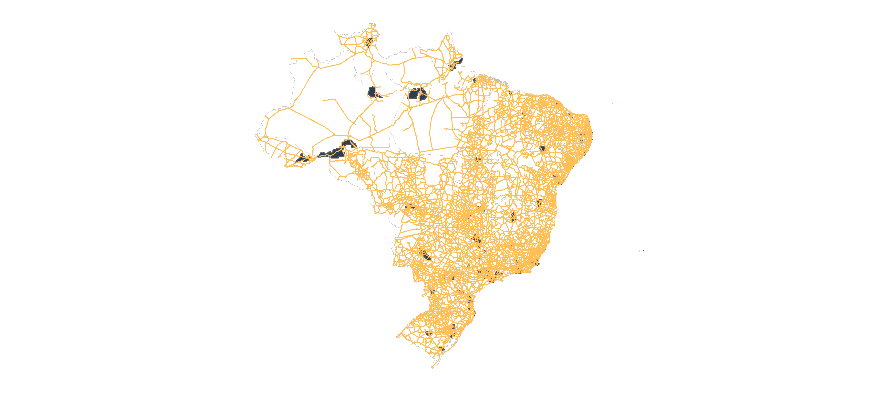
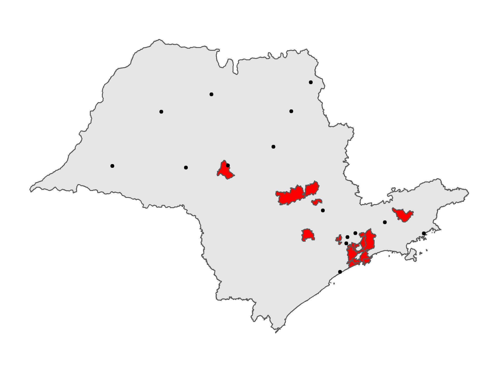
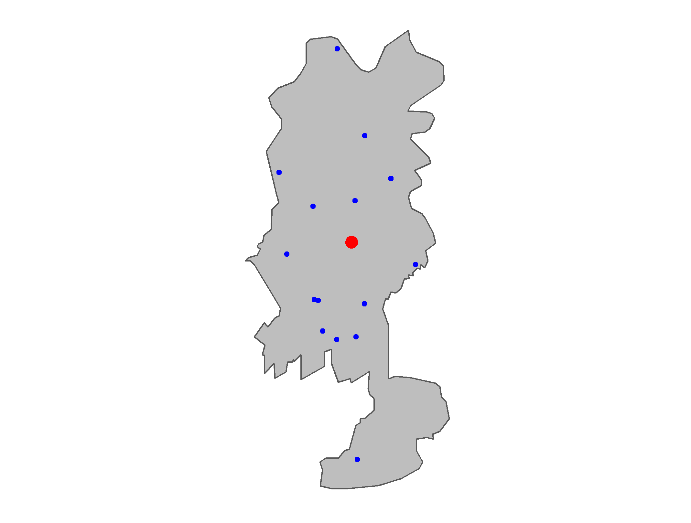

```{r setup, include=FALSE}

knitr::opts_chunk$set(message = FALSE, warning = FALSE, echo = TRUE, eval = FALSE, tidy = TRUE)
```

```{r read_files, include=FALSE, eval=TRUE}

# function to read several scripts into one code chunk

read_files <- function(files) {
  unlist(lapply(files, xfun::read_utf8))
}
```

\newpage

# Introdução {#intro}

Este relatório descreve as tarefas realizadas durante a apuração do Índice de Cidades Empreendedoras 2021 (ICE 2021), que contempla os maiores municípios brasileiros. Sete determinantes integram o índice: Ambiente Regulatório; Infraestrutura; Mercado; Acesso a Capital; Inovação; Capital Humano; Cultura. Cada determinante é composto por um grupo de indicadores, segmentados em diferentes subdeterminantes.
OS 49 indicadores, seus respectivos subdeterminantes e determinantes estão elencados na tabela a seguir, juntamente com os códigos que são usados para referir-se a eles nos documentos e arquivos do projeto:

```{r tabela, echo = FALSE, eval = TRUE}

library(magrittr)

tibble::tibble(
Determinante = c(rep("d1 Ambiente Regulatório",10),
                 rep('d2 Infraestrutura',7),
                 rep('d3 Mercado',6),
                 rep('d4 Acesso a Capital',3),
                 rep('d5 Inovação',9),
                 rep('d6 Capital Humano',8),
                 rep('d7 Cultura',6)),

Subdeterminante =  c(rep("sd11 Tempo de Processos",3),
                     rep('sd12 Tributação',4), 
                     rep('sd13 Complexidade Burocrática',3),
                     rep('sd21 Transporte Interurbano',3),
                     rep('sd22 Condições Urbanas',4),
                     rep('sd31 Desenvolvimento Econômico',3),
                     rep('sd32 Clientes Potenciais',3),
                     rep('sd41 Capital Disponível',3),
                     rep('sd51 Inputs',5),
                     rep('sd52 Outputs',4),
                     rep('sd61 Acesso e Qualidade da Mão de Obra Básica',5),
                     rep('sd62 Acesso e Qualidade da Mão de Obra Qualificada' ,3),
                     rep('sd71 Iniciativa',2),
                     rep('sd72 Instituições',4)),
Indicador = c('i111 Tempo de Viabilidade de Localização', 
              'i112 Tempo de Registro, Cadastro e Viabilidade de Nome', 
              'i113 Taxa de Congestionamento em Tribunais',
              'i121 Alíquota Interna do ICMS',
              'i121 Alíquota Interna do IPTU',
              'i123 Alíquota Interna do ISS',
              'i124 Qualidade de Gestão Fiscal',
              'i131 Simplicidade Tributária',
              'i132 CNDs Municipais',
              'i133 Atualização de Zoneamento',
              'i211 Conectividade Via Rodovias',
              'i212 Número de Decolagens por Ano',
              'i213 Distância ao Porto mais Próximo',
              'i221 Acesso à Internet Rápida',
              'i222 Preço Médio do m²',
              'i223 Custo da Energia Elétrica',
              'i224 Taxa de Homicídios',
              'i311 Índice de Desenvolvimento Humano',
              'i312 Crescimento Real Médio do PIB',
              'i313 Número de Empresas Exportadoras com Sede na Cidade',
              'i321 PIB per capita',
              'i322 Proporção entre Grandes/Médias e Médias/Pequenas Empresas',
              'i323 Compras Públicas',
              'i411 Operações de Crédito por Município',
              'i412 Proporção Relativa de Capital de Risco',
              'i413 Capital Poupado per capita',
              'i511 Proporção de Mestres e Doutores em C&T',
              'i512 Proporção de Funcionários em C&T',
              'i513 Média de Investimentos do BNDES e FINEP',
              'i514 Infraestrutura Tecnológica',
              'i515 Contratos de Concessão',
              'i521 Patentes',
              'i522 Tamanho da Indústria Inovadora',
              'i523 Tamanho da Economia Criativa',
              'i524 Tamanho das Empresas TIC',
              'i611 Nota do Ideb',
              'i612 Proporção de Adultos com pelo menos o Ensino Médio Completo',
              'i613 Taxa Líquida de Matrícula no Ensino Médio',
              'i614 Nota Média no ENEM',
              'i615 Proporção de Matriculados no Ensino Técnico e Profissionalizante',
              'i621 Proporção de Adultos com pelo menos os Ensino Superior Completo',
              'i622 Proporção de Alunos Concluintes em Cursos de Alta Qualidade',
              'i623 Custo Médio de Salários de Dirigentes',
              'i711 Pesquisas pelo Termo Empreendedor',
              'i712 Pesquisas pelo Termo MEI',
              'i721 Pesquisas por Sebrae',
              'i722 Pesquisas por Franquia',
              'i723 Pesquisas por SIMPLES Nacional',
              'i724 Pesquisas por Senac')) %>%
  knitr::kable(caption = "Determinantes, subdeterminantes e indicadores com compõem o ICE 2021 com seus respectivos códigos de referência")

```

Os trabalhos foram guiados principalmente pelo relatório final do ICE 2020 (disponível neste [link](https://drive.google.com/drive/u/1/folders/1uNwTvmKw0HNvWDWffLtCsPzE5n7-I_a7)) e pelo documento “Produto 3v3.docx”, fornecido pelo orientador, Prof. Arnaldo Mauerberg, que contém a proposta definitiva de metodologia do Índice de Cidades Empreendedoras. É importante frisar, contudo, que esta versão do ICE contém mudanças com relação à versão de 2020. São elas:

* O determinante Cultura foi reformulado, sendo composto nesta edição pelos seguintes subdeterminantes e indicadores:
  + Subdeterminante Iniciativa: busca medir o grau de confiança e intenção em empreender dentro do município. É composto por dois indicadores
    + Indicador Pesquisas pelo Termo Empreendedor (i711);
    + Indicador Pesquisas pelo Termo MEI (i712);
  + Subdeterminante Instituições: busca  medir a cultura empreendedora local. É composto pelos seguintes indicadores:
    + Indicador Pesquisas pelo Termo Sebrae (i721);
    + Indicador Pesquisas pelo Termo Franquia (i722);
    + Indicador Pesquisas pelo Termo SIMPLES Nacional (i723);
    + Indicador Pesquisas pelo Termo Senac (i724)
A mudança no determinante Cultura se deve a suspensão das pesquisas Mind Miners que o compunham;
* O índice passa a incluir, além dos 100 municípios mais populosos do Brasil, os municípios da edição anterior que eventualmente tenho saído do ranking. Em 2021, o município de Santa Maria (RS) saiu e Marabá (PA) entrou no ranking. O ICE 2021, portanto, contará com 101 municípios.

Nesta edição, a manipulação das bases de dados e o cálculo dos indicadores foram feitos exclusivamente no R. Os scripts estão disponíveis no [Apêndice](#apend) deste relatório. Além disso, todos arquivos de dados e scripts estão disponíveis no drive do projeto, disponível neste [link](https://1drv.ms/u/s!AqMHjJQ8NQwSgcFH6a7-tqbNjUz-LA?e=XJhGL2). Por fim, os códigos em R também estão disponíveis em repositório [GitHub](https://github.com/manginidouglas/ice2021).

Os indicadores foram calculados de maneira paralela pelos bolsistas. Alguns scripts fazem referência a um dataframe chamado `municode`, enquanto outros se referem a `top100_mun_cod`. Ambos possuem a mesma informação: a lista dos 101 municípios que compõem o ICE. Os scripts que geram esses dataframes estão disponíveis no [Apêndice](municode). 

\newpage


# Determinante Ambiente regulatório {#d1}

## Subdeterminante Tempo de processos {#sd11}

clique [aqui](#sd11_script) para ver o script

### Tempo de viabilidade de locação

Fonte: <https://estatistica.redesim.gov.br/tempos-abertura>.  

Período: 2020    

Cidades faltantes: São José do Rio Preto (SP), Jundiaí (SP), Maringá (PR), Anápolis (GO)  

Comentário: A coluna de interesse é *qtde. hh viabilidade end*. Calculamos o tempo médio por município e registramos como indicador o inverso desse número. Atribuimos nota zero às cidades faltantes. Detalhes estão comentados no script em apêndice.   

### Tempo de registro, cadastro, e viabilidade de nome

fonte: <https://estatistica.redesim.gov.br/tempos-abertura>.  

Período: 2020 

Cidades faltantes: São José do Rio Preto (SP), Jundiaí (SP), Maringá (PR), Anápolis (GO) 

Comentário: As colunas de interesse são *qtde. hh viabilidade de nome*, *qtde. hh liberação dbe*, *qtde. hh horas deferimento*. Agrupamos por estado e somamos as 3 colunas. O indicador é o inverso da média simples por estado. Municípios do mesmo estado terão notas iguais.  

### Taxa de congestionamento em tribunais

Fonte: <https://paineis.cnj.jus.br/QvAJAXZfc/opendoc.htm?document=qvw_l%2FPainelCNJ.qvw&host=QVS%40neodimio03&anonymous=true&sheet=shPDPrincipal>  

Período: 2020  

Comentário: Usamos os parâmetros de pesquisa: justiça = Justiça Estadual, campos agrupados = Sede Município e tipo de variável = novos, pendentes e baixados. A taxa líquida de congestionamento é definida^[https://www.cnj.jus.br/gestao-estrategica-e-planejamento/estrategia-nacional-do-poder-judiciario-2009-2014/indicadores/03-taxa-de-congestionamento/
] como $$1 - \frac{\text{baixados}}{\text{novos + pendentes}}$$. O indicador é o inverso da taxa de congestionamento.  

## Subdeterminante Tributação {#sd12}

clique [aqui](#sd12_script) para ver o script

### Alíquota interna do ICMS
Fonte: <https://siconfi.tesouro.gov.br/siconfi/index.jsf>  

Período icms: 2020
Período pib:  2018

Comentário: Usamos a tabela Receitas Orçamentárias (Anexo I-C). Trabalhamos apenas com receitas brutas realizadas e a conta 1.1.1.8.02.0.0. O indicador é o inverso do icms por unidade de pib municipal. Detalhes estão comentados no script em apêndice. 

### Alíquota interna do IPTU

Fonte: <https://siconfi.tesouro.gov.br/siconfi/index.jsf>  

Período icms: 2020  
Período pib = 2018 

Cidades faltantes: Brasília (DF), Carapicuíba (SP)  

Comentário: Usamos a tabela Receitas Orçamentárias (Anexo I-C).Trabalhamos apenas com receitas brutas realizadas e as contas   1.1.1.8.01.1.0 e 1.1.1.8.02.3.0. Detalhes estão comentados no script em apêndice. 

### Alíquota interna do ISS

Fonte: <https://siconfi.tesouro.gov.br/siconfi/index.jsf>  

Período icms: 2020  
Período pib = 2018  

Cidades faltantes: Brasília (DF), Carapicuíba (SP), Uberaba (MG), São João de Meriti (RJ)  Belford Roxo (RJ)  

Comentário:  Usamos a tabela Receitas Orçamentárias (Anexo I-C). Detalhes estão comentados no script em apêndice. 


### Qualidade da Gestão Fiscal
Fonte: <https://www.firjan.com.br/ifgf/>  

Período: 2018

Comentário: Não há novos dados desde a última edição do ICE, então usamos os valores passados. 


## Subdeterminante Complexidade burocrática {#sd13}

clique [aqui](#sd13_script) para ver o script

### Simplicidade tributária

Fonte: <https://siconfi.tesouro.gov.br/siconfi/index.jsf>  

Período: 2020  

Cidades faltantes: Brasília (DF)

Comentário: Para filtrar as contas orçamentárias corretas, lemos o relatório do ice passado^[pdf_contas.pdf, pp.15-17] no R. O indicador é o produto dos índices de Herfindahl-Hirshmann (ihh) e de visibilidade (iv). O ihh é a soma dos quadrados da participação relativa do tributo na arrecadação total. A visibilidade é a participação relativa de uma soma de de tributos^[IPTU, ITBI, ITR, IRRF] na arrecadação total. Detalhes no script em apêndice. 

### CND's municipais

Fonte: <https://www.ibge.gov.br/estatisticas/sociais/saude/10586-pesquisa-de-informacoes-basicas-municipais.html?=&t=downloads>  

Período: 2019  

Comentário: variável binária igual a 1 se município emite certidão negativa de débitos. Utilizamos a quarta aba da planilha, coluna MTIC1211. Detalhes no script em apêndice.

### Atualização de zoneamento

fonte: <https://www.ibge.gov.br/estatisticas/sociais/saude/10586-pesquisa-de-informacoes-basicas-municipais.html?=&t=downloads>  

Período: 2018

Comentário: quantidade de anos desde que o município mudou a lei de zoneamento. O IBGE excluiu essa pergunta na pesquisa MUNIC 2019, então verificamos os sítios eletrônicos das prefeituras.  

\newpage


# Determinante Infraestrutura {#d2}

## Subdeterminante Transporte Interurbano {#sd21}

Para os indicadores de rodovias, portos e aeroportos, importamos os dados georeferenciados de cada estrutura e fizemos operações geométricas para encontrar os indicadores. Por exemplo, encontrar as rodovias que passam por um município reduz-se a encontrar o número de interseções entre o polígono do município e a linha que descreve a estrada. Esses cálculos estão no script em apêndice. [ver script](#sd21_script)  

```{r exemplo_rodovia, echo=FALSE, eval = TRUE, fig.cap="Exemplo de rodovia", out.width = '100%'}


```

### Conectividade das rodovias

Fonte dos shape files das rodovias: <http://servicos.dnit.gov.br/vgeo/>  

Período: 2021  

Comentário: Consideramos apenas rodovias federais e estaduais. Construímos uma função que verifica se o município tem interseção com ao menos um trecho da rodovia. Nosso método implica incluir rodovias que estão próximas, mas não entram de fato no município. Consideramos este método melhor, pois reflete todas as opções de entrada e saída do território. 

### Número de decolagens por ano

fonte dos dados de voos: <https://www.anac.gov.br/acesso-a-informacao/dados-abertos/areas-de-atuacao/voos-e-operacoes-aereas/dados-estatisticos-do-transporte-aereo>    

Fonte dos Shape files dos aeroportos: <https://www.gov.br/infraestrutura/pt-br/assuntos/dados-de-transportes/bit/bitmodosmapas#mapaero>  

Período: 2020  

Comentário: Decolagens de voos regulares com origem no município. Faltam dados para metade dos municípios. Para completar os faltantes, atribuímos um número total de decolagens com base aeroporto mais próximo (distância euclidiana).   

```{r aeroporto_plot, echo=FALSE, eval = TRUE, fig.cap="Exemplo: estado de SP e aeroportos mais próximos", out.width = '100%'}


```

\newpage
 
### Distância ao porto mais próximo

Fonte dos shape files dos portos: <https://www.gov.br/infraestrutura/pt-br/assuntos/dados-de-transportes/bit/bitmodosmapas>  

Período: 2020  

Comentário: Distância do porto mais próximo ao município. Consideramos apenas portos públicos ou os fluvias do Amazonas. Tomamos o centro do polígono que representa o município como referência (ver figura).  

```{r porto_plot, echo=FALSE, eval = TRUE, fig.cap="Exemplo: centro de Ananindeua-PA e portos mais próximos", out.width = '100%'}


```


## Subdeterminante Condições Urbanas {#sd22}

clique [aqui](#sd22_script) para ver o script

### Acesso à internet rápida

Fonte: <https://dados.gov.br/dataset/dados-de-acessos-de-comunicacao-multimidia>  

Período: 2020  

Comentário: número de acessos à internet de alta velocidade (acima de 12Mbps) por habitante.

### Preço médio do m²

fonte: <https://www.zapimoveis.com.br/>  

Período: 2021

Comentário: raspamos o site a procura de imóveis a venda. Extraímos preço e área útil e fizemos a média para cada município. Excluímos do cálculo os anúncios que implicavam um preço de metro quadrado menor do que 100 reais e maior do que 10.000 reais^[esses outliers aparecem em anúncios cujo preço refere-se a um prédio e a área a uma sala do prédio]. Para cada município, somamos o preço de todos os anúncios e dividimos pela soma de todas as áreas. Procuramos por 350 anúncios de cada município.  

### Custo da energia elétrica

Fonte distribuidoras: <http://www2.aneel.gov.br/relatoriosrig/(S(fgy4psttnrfsam2x1s40fgib))/relatorio.aspx?folder=sfe&report=DistribuidoradecadaMunicipio>  

Fonte das tarifas: <https://www.aneel.gov.br/ranking-das-tarifas>  

Período: 2021  

Comentário: Montamos manualmente a base de dados que indica qual distribuidora atende cada município.  

### Taxa de Homicídios

fonte: <http://tabnet.datasus.gov.br/cgi/tabcgi.exe?sim/cnv/obt10br.def>  

Período: 2019  


Comentário: mortes causadas por agressão, ponderado pelo número estimado de habitantes em 2020. No site do datasus, selecionamos Conteúdo igual a *Óbitos p/ Ocorrência* e Grupo CID-10 igual a *agressões*. Os dados em formato excel estão na pasta de arquivos e o [script](#infra) em R para reproduzir o cálculo no apêndice deste documento. 

\newpage
 
 
 
# Determinante Mercados {#d3}

## Subdeterminante Desenvolvimento Econômico {#sd31}
clique [aqui](#sd31_script) para ver o script

### índice de desenvolvimento humano

Fonte: <http://www.atlasbrasil.org.br/ranking>  

Período: 2010

Comentário: Não há novos dados desde a última edição do índice. Apenas adicionamos as colunas código do município e sigla da UF. 

### Crescimento médio real do PIB

Fonte: sidra-IBGE  

Período: 2014 a 2018  

Comentário: crescimento médio do pib municipal. Usamos os pacotes `basedosdados` e `sidrar` para encontrar o pib municipal e calcular o deflator do pib. 

### Número de exportadoras sediadas no município

Fonte 1: Rais-IBGE  
Fonte 2: <https://www.gov.br/produtividade-e-comercio-exterior/pt-br/assuntos/comercio-exterior/estatisticas/empresas-brasileiras-exportadoras-e-importadoras>  

Período: 2019  

Comentário: Usamos o pacote `basedosdados` para acessar a RAIS e obter a quantidade de funcionarios por empresa. Dividimos o número de empresas exportadoras pelo total de empresas sediadas no município com pelo menos um funcionário.  


## Subdeterminante Clientes Potenciais {#sd32}
clique [aqui](#sd32_script) para ver o script

### PIB per capita

Fonte: Sidra-IBGE  

Período: 2018

Comentário: Acessamos os dados via base dos dados. Detalhes no script. 

### Proporção de grandes empresas  

Fonte: Rais-IBGE  

Período: 2019  

Comentário: Razão de duas proporções: empresas grandes por empresas médias e médias por pequenas. Acessamos os dados via base dos dados. O tamanho da empresa é dado pela variável `qtde_vinculos_ativos`. Empresas pequenas têm entre 10 e 49 funcionários; médias entre 50 e 249; grandes, acima de 250. 

\newpage 


### Indicador Compras Públicas (i323) {#i323}

Este indicador refere-se ao total de despesas e investimentos feitos pela prefeitura dividido pelo número de empresas com pelo menos um funcionário no município. Os seguintes passos descrevem o procedimento adotado para se chegar ao indicador:  

1. Obter valor total de despesas e investimentos feitos pela prefeitura dos municípios do ICE
  + Acessar site do [Sistema de Informações Contábeis e Fiscais do Setor Público Brasileiro (Siconfi) e acessar “contas anuais” na seção “consultar finbra” em “consultas”;
  + Selecionar como “”exercício” o ano de 2020, ano mais recente disponível, como “escopo” selecionar Município, e selecionar a tabela “Despesas Orçamentárias (Anexo I-D)”;
  + Observações: na data em de acesso à tabela (26/08/2021), ainda faltavam dados de Belém (PA). Foi escolhido manter os dados de 2020 uma vez que o documento “Produto 3v3” sugere selecionar o ano anterior somente quando os dados faltantes do ano mais recente forem “muitos”.
  + Os dados de Brasília foram coletados à parte utilizando como escopo “Estados/DF” na seleção de tabela no site da Siconfi, já que, para os dados de despesas orçamentárias, Brasília é tratada como um estado e não um município;
2. Obter para cada município o número total de empresas com pelo menos um funcionário. 
  + Esse dado também é utilizado para o indicador Número de Empresas Exportadoras com Sede na Cidade (i313). O procedimento adotado para obtenção dos dados foi o mesmo .Foram usados os dados mais recentes disponíveis na RAIS, isto é, do ano de 2019
3. Calcular o indicador para cada município de acordo com a seguinte fórmula: $$\text{i323} = \frac{\text{despesas +investimentos}}{\text{quantidade de empresas com pelo menos um funcionário}}$$
O tratamento das bases de dados e o cálculo do índice foram feitos usando o R. O script encontra-se no [Apêndice](#i323_script) deste relatório. O script e os arquivos de dados com resultados dos cálculos estão disponíveis no drive do projeto.


# Determinante Acesso a Capital {#d4}

## Subdeterminante Capital Disponível {#sd41}
### Indicador Operações de Crédito por Município (i411) {#i411}

Este indicador refere-se ao valor, em reais, das operações de crédito no município para pessoas físicas e jurídicas, dos bancos múltiplos com carteira comercial, dividido pelo PIB total do município. Os seguintes passos descrevem o procedimento adotado para se chegar ao indicador:  

1. Obter valor em reais das operações de crédito para pessoas físicas e jurídicas por município;
  + Acessar site do [Banco Central](http://www4.bcb.gov.br/fis/cosif/estban.asp) e baixar arquivo “Estatística Bancária Mensal por município” referente ao mês de dezembro de 2020 (ano mais recente com dados disponíveis) Na planilha, é utilizada apenas a coluna chamada “VERBETE_160_OPERACOES_DE_CREDITO";
2. Obter PIB dos municípios do ICE a preços correntes;
  + Acessar o site do [SIDRA-IBGE](https://sidra.ibge.gov.br/tabela/5938) e baixar a planilha número 5938, escolhendo a opção “Produto Interno Bruto a Preços Correntes” e o nível territorial “município”. Os dados selecionados se referem ao ano mais recente com dados disponíveis, 2018;
3. Calcular o indicador para cada município de acordo com a seguinte fórmula: $$\text{i411} = \frac{\text{total de operações de crédito}}{\text{PIB}}$$
O tratamento das bases de dados e o cálculo do índice foram feitos usando o R. O script encontra-se no [Apêndice](#i411_script) deste relatório. O script e os arquivos de dados com resultados dos cálculos estão disponíveis no drive do projeto.


### Indicador Proporção Relativa de Capital de Risco (i412) {#i412}

Este indicador consiste na soma de todos os investimentos de risco, em reais, recebidos por empresas do município no último ano dividido pelo PIB do município. Os seguintes passos descrevem o procedimento adotado para se chegar ao indicador:

1. Obter valor de capital de risco levantados por empresas dos municípios do ICE
  + Acessar a base de dados [Crunchbase](https://www.crunchbase.com/) para obter os dados. Na área de busca, selecionar aba “Companies” e aplicar seguintes filtros:
    + Em “Financials” marcar “Past Year” na opção “Last Funding Date”;
    + Em “Overview”, digitar nome do município na área “Headquarters Location”. Muitos municípios possuem erros nessa base de dados quanto a sua localização. Brasília, por exemplo, está cadastrada como uma cidade do Rio Grande do Norte. Contudo, esses erros não comprometeram o levantamento dos dados;
  + Buscar municípios manualmente um a um e obter o valor de capital de risco levantado pelas empresas do município no último ano. Foi montada uma tabela no excel com os dados de capital de risco por município;
2. Obter taxa de câmbio média do último ano de moedas diferente do real presentes na base de dados construída no passo 1 e converter valores para real;
  + Obter dados de taxa de câmbio média no site [OFX](https://www.ofx.com/en-au/forex-news/historical-exchange-rates/yearly-average-rates/) ou outro similar. Transformar todos valores para real.
3. Obter PIB municipal;
  + Esse dado foi obtido no indicador [PIB per capita](#sd32). Aqui, usamos o arquivo "pib_mun.csv" que foi obtido exportando o PIB dos municípios usando o script em R do indicador PIB per capita;
4. Calcular o indicador para cada município de acordo com a seguinte fórmula: $$\text{i412} = \frac{\text{total de invesimentos de risco}}{\text{PIB do município}}$$

O tratamento das bases de dados e o cálculo do índice foram feitos usando o R. O script encontra-se no [Apêndice](#i412_script) deste relatório. O script e os arquivos de dados com resultados dos cálculos estão disponíveis no drive do projeto.


### Indicador Capital Poupado per capita (i413) {#i413}

Este indicador refere-se ao valor, em reais, das operações de depósitos em poupança e depósitos a prazo feitos no município, de pessoas físicas e jurídicas, dividido pelo número de habitantes estimado do município. Os seguintes passos descrevem o procedimento adotado para se chegar ao indicador:  

1. Obter dados de valor médio mensal de depósitos em poupança e de longo prazo por município;
  + Acessar site do [Banco Central](https://www.bcb.gov.br/estatisticas/estatisticabancariamunicipios) e baixar arquivo “Estatística Bancária Mensal por município” referente ao mês de dezembro de 2020 (último disponível).Na planilha, utilizar as colunas “VERBETE_420_DEPOSITOS_DE_POUPANCA”  e “VERBETE_432_DEPOSITOS_A_PRAZO”;
2. Obter estimativa populacional dos municípios do ICE;
  + Os dados mais recentes são de 2021. Acessar site do [IBGE](https://www.ibge.gov.br/estatisticas/sociais/populacao/9103-estimativas-de-populacao.html?=&t=resultados) e baixar tabela;
3. Calcular indicador  para cada município de acordo com a seguinte fórmula: 
$$\text{i413} = \frac{\text{valor de depósitos em poupança e a prazo}}{\text{estimativa populacional}}$$ 
O tratamento das bases de dados e o cálculo do índice foram feitos usando o R. O script encontra-se no [Apêndice](#i413_script) deste relatório. O script e os arquivos de dados com resultados dos cálculos estão disponíveis no drive do projeto.

\newpage
# Determinante Inovação {#d5}
## Subdeterminante Inputs {#sd51}

### Indicador Proporção de Mestres e Doutores em C\&T (i511) {#i511}

Este indicador refere-se ao número de mestres e doutores titulados nas cidades nas áreas de ciências, tecnologia, engenharias e matemática dividido pelo número total de empresas com pelo menos um funcionário no município. Os seguintes passos descrevem o procedimento adotado para se chegar ao indicador:

1. Obter para cada município o número de mestres e doutores titulados nas áreas de ciências, tecnologia, engenharias e matemática;
  + Acessar site da [CAPES](https://dadosabertos.capes.gov.br/) e baixar conjunto de dados “[2017 a 2019] Discentes da Pós-Graduação stricto sensu do Brasil”.

2. Obter para cada município o número total de empresas com pelo menos um funcionário. 
  + Este dado também é utilizado para o indicador Número de Empresas Exportadoras com Sede na Cidade (i313). O procedimento adotado para obtenção dos dados foi o mesmo. Foram usados os dados mais recentes disponíveis na RAIS, isto é, do ano de 2019;
  
3. Calcular o indicador  para cada município do ICE de acordo com a seguinte fórmula: 
$$\text{i511} = \frac{\text{número de mestres e doutores em C\&T}}{\text{número de empresas com pelo menos um funcionário}}$$
O tratamento das bases de dados e o cálculo do índice foram feitos usando o R. O script encontra-se no [Apêndice](#i511_script) deste relatório. O script e os arquivos de dados com resultados dos cálculos estão disponíveis no drive do projeto.


### Indicador Proporção de Funcionários em C\&T (i512) {#i512}

Este indicador refere-se ao número de funcionários do município que trabalham nas áreas de ciência, tecnologia, engenharia, matemática (critério feito pela Classificação Brasileira de Ocupações - CBO) dividido pelo número total de trabalhadores do município. Os seguintes passos descrevem o procedimento adotado para se chegar ao indicador:

1. Obter para cada município o número de funcionários que trabalham nas áreas de ciência e tecnologia, engenharia, matemática;
  + Fonte: RAIS, Ministério do Trabalho. As informações encontram-se na tabela de vínculos da RAIS. Os últimos dados disponíveis são do ano de 2019;
  + Os dados são acessados por meio do *data lake* público [Base dos Dados](https://basedosdados.org/);
  + As ocupações relacionadas à ciência e tecnologia segundo  a classificação da CBO são as seguintes: 
    + Subgrupo Principal 73: TRABALHADORES DA FABRICACAO E INSTALACAO ELETROELETRONICA;
    + Subgrupo Principal 20 “PESQUISADORES E PROFISSIONAIS POLICIENTIFICOS”;
    + Subgrupo Principal 21:“PROFISSIONAIS DAS CIÊNCIAS EXATAS, FÍSICAS E DA ENGENHARIA”
    + Subgrupo Principal 31 :“TECNICOS DE NIVEL MEDIO DAS CIENCIAS FISICAS, QUIMICAS, ENGENHARIA E AFINS”;
    + Subgrupo Principal 30: “TECNICOS POLIVALENTES”:
    + Subgrupo Principal 39: “OUTROS TECNICOS DE NIVEL MEDIO”; e,
    + Subgrupo Principal 72: “TRABALHADORES DA TRANSFORMAÇÃO DE METAIS E DE COMPOSITOS”;
2. Obter número total de trabalhadores no município;
  + Fonte: RAIS, Ministério do Trabalho. As informações encontram-se na tabela de vínculos da RAIS. Os últimos dados disponíveis são do ano de 2019;
  + Os dados são acessados por meio do *data lake* público [Base dos Dados](https://basedosdados.org/);
3. Calcular indicador de acordo com a seguinte fórmula: $$\text{i512} = \frac{\text{número de funcionários de C\&T}}{\text{número total de trabalhadores}}$$

O tratamento das bases de dados e o cálculo do índice foram feitos usando o R. O script encontra-se no [Apêndice](#i512_script) deste relatório. O script e os arquivos de dados com resultados dos cálculos estão disponíveis no drive do projeto.
 
 
 
 
### Indicador Média de Investimentos do BNDES e da FINEP (i513) {#i513}

Este indicador refere-se ao número total de investimentos do BNDES e da FINEP dividido pelo total de empresas com pelo menos um funcionário no ano corrente. Os seguintes passos descrevem o procedimento adotado para se chegar ao indicador:

1. Obter dados de investimentos do BNDES nos municípios do ICE
  + Acessar a [central de downloads do site do BNDES](https://www.bndes.gov.br/wps/portal/site/home/transparencia/centraldedownloads) e selecionar "Operações contratadas na forma direta e indireta não automática (2002 a 30.06.2021)”; 

2. Obter dados de investimentos da FINEP nos municípios do ICE;
  + Acessar site da [FINEP](http://www.finep.gov.br/transparencia-finep/projetos-contratados-e-valores-liberados), na seção “Projetos contratados e valores liberados” e selecionar a planilha “Projetos Contratados” para obter os dados referentes a 2020;

3. Obter para cada município o número total de empresas com pelo menos um funcionário; 
  + Este dado também é utilizado para o indicador Número de Empresas Exportadoras com Sede na Cidade (i313). O procedimento adotado para obtenção dos dados foi o mesmo. Foram usados os dados mais recentes disponíveis na RAIS, isto é, do ano de 2019;
 
4. Calcular o indicador para cada município de acordo com a fórmula: $$\text{i313} = \frac{\text{valores contratados BNDES + valores contratados FINEP}}{\text{nº de empresas com pelo menos um funcionário}}$$ 
 
 O tratamento das bases de dados e o cálculo do índice foram feitos usando o R. O script encontra-se no [Apêndice](#i513_script) deste relatório. O script e os arquivos de dados com os resultados dos cálculos estão disponíveis no drive do projeto.
 
 
 
### Indicador Infraestrutura Tecnológica (i514) {#i514}

A variável a medir infraestrutura tecnológica é uma dummy igual a um se o município foi listado no projeto Parques Tecnológicos como possuindo parque, e zero caso contrário. Como o documento usado como fonte para obter esses dados é o mesmo estudo utilizado na edição de 2020 do ICE e a única alteração na lista das 100 cidades mais populosas é a adição de Marabá (PA), o indicador será o mesmo do ano passado, com a adição do dado referente a Marabá. Então, o seguinte procedimento foi adotado para calcular o indicador:

1. Importar tabela com indicador i514 do ICE 2020;
+ Baixar a planilha “Indicador Infraestrutura Tecnológica.xlsx” no [drive do projeto ICE 2020](https://drive.google.com/drive/u/0/folders/1zoR8VDP-yLox28dgplZSDFOfeXtGTrm1)  ;
2. Acessar o estudo ["Indicadores de Parques Tecnológicos"](https://gestiona.com.br/wp-content/uploads/2019/10/MCTIC-UnB-ParquesTecnologicos-Portugues-final.pdf) que serve de base para o indicador e consultar se existem parques tecnológicos em operação em Marabá. Adicionar linha com a informação sobre o município Marabá na base de dados mencionada acima; 
  + Para este município a variável é igual a zero;

O tratamento da base de dados e o cálculo do índice foram feitos usando o R. O script encontra-se no [Apêndice](#i514_script) deste relatório. O script e os arquivos de dados com os resultados dos cálculos estão disponíveis no drive do projeto.


### Indicador Contratos de Concessão (i515) {#i515}

Este indicador refere-se ao número total de contratos de Propriedade Intelectual depositados, dividido pelo total de empresas com pelo menos um funcionário, e multiplicado por mil (pois o dado é para cada mil empresas).  

Para este indicador é importante ressaltar que os dados disponíveis de propriedade intelectual depositados a nível municipal não mudaram desde a edição passada do ICE. Os dados disponíveis são referentes aos anos de 2016 e 2017. Portanto, este indicador será o mesmo do ano passado, com a adição do dado referente ao município de Marabá (PA), que entrou no ranking dos municípios mais populosos. Para detalhes de como foi calculado, veja relatório final do ICE 2020. Ainda sim, utilizou-se o R criar um arquivo csv com os dados do indicador de 2020 adicionados ao dado de Marabá (PA). O script encontra-se no [Apêndice](#i515_script) deste relatório. O script e os arquivos de dados com os resultados dos cálculos estão disponíveis no drive do projeto.


## Subdeterminante Outputs {#sd52}

### Indicador Patentes (i521) {#i521}

Para a apuração deste indicador, primeiro devem ser somados o total de patentes de inovação, de adição de inovação e de modelos de utilidades nos dois últimos anos disponíveis por município. Então, este total deve ser dividido pelo número de empresas com pelo menos um funcionário em cada um dos 100 municípios. Os seguintes passos descrevem o procedimento adotado para se chegar ao indicador:

1. Obter o total de patentes de inovação (PI), de adição de inovação (CA) e de modelos de utilidades (MU) nos últimos dois anos  em cada município;
  + Baixar os dados no site do [Instituto Nacional da Propriedade Industrial (INPI)](https://www.gov.br/inpi/pt-br/central-de-conteudo/estatisticas), na seção “estatísticas”, e “Indicadores de Propriedade Industrial”. Os dados mais recentes disponíveis são de 2019;
  
2. Obter para cada município o número total de empresas com pelo menos um funcionário. 
  + Este dado também é utilizado para o indicador Número de Empresas Exportadoras com Sede na Cidade (i313). O procedimento adotado para obtenção dos dados foi o mesmo. Foram usados os dados mais recentes disponíveis na RAIS, isto é, do ano de 2019;
  
3. Calcular o indicador  para cada município do ICE de acordo com a seguinte fórmula: $$\text{i521} = \frac{\text{nº de patentes PI ou CA ou MU}}{\text{nº de empresas com pelo menos um funcionário}}$$

O tratamento das bases de dados e o cálculo do índice foram feitos usando o R. O script encontra-se no [Apêndice](#i521_script) deste relatório. O script e os arquivos de dados com resultados dos cálculos estão disponíveis no drive do projeto.


### Indicador Tamanho da Indústria Inovadora (i522) {#i522}

Este indicador refere-se à proporção de empresas de indústria inovadora (classes da CNAE 2.0) em relação ao número total de empresas com ao menos um funcionário. A lista de classes associadas a Indústria Inovadora está listada em [Apêndice](#cnae_inovadora) a este relatório. Os seguintes passos descrevem o procedimento adotado para se chegar ao indicador:

1. Obter número de empresas de indústria inovadora;
  + Obter, a partir da planilha “Indicador Tamanho da Indústria Inovadora.xlsx” no drive do projeto ICE 2020, a lista de classes associadas a Indústria Inovadora. São 86 classes que estão listadas no [Apêndice](#inovador) deste relatório. Usar a tabela “CNAE20_EstruturaDetalhada.xls” baixada no site do IBGE para associar à cada denominação de classe seu código numérico;
  + Obter dados de quantidade de empresas de indústria inovadora por meio da tabela de estabelecimentos da RAIS. Selecionar as classes CNAE 2.0 que compõem a indústria inovadora. A RAIS é acessada por meio do *data lake* público [Base dos Dados](https://basedosdados.org/);
2. Obter para cada município o número total de empresas com pelo menos um funcionário; 
  + Este dado também é utilizado para o indicador Número de Empresas Exportadoras com Sede na Cidade (i313). O procedimento adotado para obtenção dos dados foi o mesmo. Foram usados os dados mais recentes disponíveis na RAIS, isto é, do ano de 2019;
3. Calcular indicador de acordo com a seguinte fórmula: $$\text{i522} = \frac{\text{nº de empresas de indústria inovadora}}{\text{nº de empresas com pelo menos um funcionário}}$$

O tratamento das bases de dados e o cálculo do índice foram feitos usando o R. O script encontra-se no [Apêndice](#i522_script) deste relatório. O script e os arquivos de dados com resultados dos cálculos estão disponíveis no drive do projeto.

### Indicador Tamanho da Economia Criativa (i523) {#i523}

Este indicador consiste na razão entre empresas de economia criativa selecionadas a partir das classes da CNAE 2.0 no município, e o número total de empresas com ao menos um funcionário no município. A lista de classes associadas a Economia Criativa está listada em [Apêndice](#cnae_criativa) a este relatório. Os seguintes passos descrevem o procedimento adotado para se chegar ao indicador:

1. Obter número de empresas de economia criativa nos municípios do ICE
  + Obter, a partir da planilha “Indicador Tamanho da Economia Criativa.xlsx” no drive do projeto ICE 2020, a lista de classes associadas a Economia Criativa. São 37 classes que estão listadas no Apêndice deste relatório. 
  + Usar a tabela “CNAE20_EstruturaDetalhada.xls” baixada no site do IBGE para associar à cada denominação de classe seu código numérico. 
  + Obter dados de quantidade de empresas de economia criativa por meio da tabela de estabelecimentos da RAIS. Selecionar as classes CNAE 2.0 que compõem a indústria inovadora. A RAIS é acessada por meio do *data lake* público [Base dos Dados](https://basedosdados.org/);
2. Obter para cada município o número total de empresas com pelo menos um funcionário; 
  + Este dado também é utilizado para o indicador Número de Empresas Exportadoras com Sede na Cidade (i313). O procedimento adotado para obtenção dos dados foi o mesmo. Foram usados os dados mais recentes disponíveis na RAIS, isto é, do ano de 2019;
3. Calcular indicador para cada município de acordo com a seguinte fórmula: $$\frac{\text{nº de empresas de economia criativa}}{\text{nº de empresas com pelo menos um funcionário}}$$

O tratamento das bases de dados e o cálculo do índice foram feitos usando o R. O script encontra-se no [Apêndice](#i523_script) deste relatório. O script e os arquivos de dados com resultados dos cálculos estão disponíveis no drive do projeto.


### Indicador Tamanho das Empresas TIC (i524) {#i524}
Este indicador refere-se à razão entre o número empresas dos setores de tecnologia da informação e comunicação (TIC) no município, selecionadas a partir das classes da CNAE 2.0, e o número total de empresas com ao menos um funcionário no município. A lista de classes associadas a Empresas TIC está listada em [Apêndice](#cnae_tic) a este relatório. Os seguintes passos descrevem o procedimento adotado para se chegar ao indicador:  

1. Obter número de empresas TIC nos municípios de interesse;
  + Obter, a partir da planilha “Indicador Tamanho das Empresas TIC.xlsx” no drive do projeto ICE 2020, a lista de classes associadas a Economia Criativa. São 24 classes que estão listadas no Apêndice deste relatório; 
  + Usar a tabela “CNAE20_EstruturaDetalhada.xls” baixada no site do IBGE para associar à cada denominação de classe seu código numérico; 
  + Obter dados de quantidade de empresas TIC por meio da tabela de estabelecimentos da RAIS. Selecionar as classes CNAE 2.0 que caracterizam empresas TIC. A RAIS é acessada por meio do data lake público Base dos Dados;
2. Obter para cada município o número total de empresas com pelo menos um funcionário; 
  + Este dado também é utilizado para o indicador Número de Empresas Exportadoras com Sede na Cidade (i313). O procedimento adotado para obtenção dos dados foi o mesmo. Foram usados os dados mais recentes disponíveis na RAIS, isto é, do ano de 2019;
3. Calcular indicador para cada município de acordo com a seguinte fórmula: $$\text{i524} = \frac{\text{nº de empresas TIC}}{\text{nº de empresas com pelo menos um funcionário}}$$

O tratamento das bases de dados e o cálculo do índice foram feitos usando o R. O script encontra-se no [Apêndice](#i524_script) deste relatório. O script e os arquivos de dados com resultados dos cálculos estão disponíveis no drive do projeto.


\newpage

# Determinante Capital Humano {#d6}
## Subdeterminante Acesso e Qualidade da Mão de Obra Básica {#sd61}

### Indicador Nota do Ideb (i611) {#i611}

Este indicador trata-se do Índice final do IDEB de cada município, que é calculado com base no desempenho escolar dos alunos dos anos finais do ensino fundamental nas escolas públicas dos municípios. Os seguintes passos descrevem o procedimento adotado para se chegar ao indicador:  

1. Obter índice final Ideb de cada município do ICE;
  + Os dados são fornecidos pelo INEP no site do [IDEB](http://ideb.inep.gov.br/). Seleciona-se “Município”, então, em Rede/Dependência Administrativa, é selecionada a opção “Pública (Federal, Estadual e Municipal). Em série, seleciona-se “8ª série / 9º ano”. A consulta é feita por cidade, selecionando-a nos campos UF e município;
  + Os dados mais recentes, de 2019, foram, então, reunidos na planilha “i611 base de dados.xlxs”, disponível no drive de arquivos do projeto. 
  
O tratamento das bases de dados e o cálculo do índice foram feitos usando o R. O script encontra-se no [Apêndice](#i611_script) deste relatório. O script e os arquivos de dados com resultados dos cálculos estão disponíveis no drive do projeto.

### Indicador Proporção de adultos com pelo menos o Ensino Médio completo (i612) {#i612}

Este indicador é a média simples de dois dados: 

1. A razão entre o número de inscritos no ENEM no município que declararam ter pai com pelo menos ensino médio completo e total de inscritos no município;
2. A razão entre o número de inscritos no ENEM no município que declararam ter mãe com pelo menos ensino médio completo e total de inscritos no município.  

A base de dados deste indicador são os microdados do ENEM fornecidos pelo [INEP](http://portal.inep.gov.br/microdados). No website, selecionou-se a base de dados mais recente, referente à edição de 2019. Essa base de dados contém os dados para este indicador e também para os indicadores Nota Média no Enem (i614) e Proporção de Adultos com pelo menos o Ensino Superior Completo (i621). 

O tratamento das bases de dados e o cálculo do índice foram feitos usando o R. O script encontra-se no [Apêndice](#i612_script) deste relatório. O script e os arquivos de dados com resultados dos cálculos estão disponíveis no drive do projeto.

### Indicador Taxa Líquida de Matrícula no Ensino Médio (i613) {#i613}

Este indicador refere-se ao número de alunos entre 15 e 17 anos matriculados no ensino médio dividido pela população estimada de jovens com idade entre 15 e 17 anos.
Então, a estimativa da população entre 15 e 17 anos é calculada com base nos dados do censo de 2010, aumentada pelo percentual de crescimento da população total daquele município até o ano em vigor. Por exemplo, se a população total de São Paulo cresceu 10% entre 2010 e 2021, a população de jovens entre 15 e 17 anos de 2010 é acrescida em 10%. Os passos tomados para chegar ao índice estão descritos a seguir:

1. Obter número de alunos entre 15 e 17 anos matriculados no EM em cada município;
  + Os dados de alunos matriculados estão disponíveis na base de microdados do censo escolar de 2020 do INEP;
2. Obter população entre 15 e 17 anos no município;
  + Dados disponíveis no Censo 2010, obtidos no site do IBGE, baixando os dados do censo por município e idade;
3. Obter população total do município em 2010;
  + Dados disponíveis no Censo 2010. Contudo, os dados foram obtidos por meio do *data lake* público Base dos Dados;
4. Obter estimativa populacional do município em 2021;
  + Dados obtidos no site do IBGE;
5. Calcular  fator de crescimento populacional do município entre 2010 e 2021 a partir dos dados obtidos;
6. Calcular população estimada do município em 2020 de pessoas entre 15 e 17;
7. Calcular indicador para cada município por meio da seguinte fórmula: $$\text{i613} = \frac{\text{matriculados no Ensino Médio de 15 e 17 anos em 2020}}{\text{estimativa populacional de pessoas entre 15 a 17 em 2020}}$$


O tratamento das bases de dados e o cálculo do índice foram feitos usando o R. O script encontra-se no [Apêndice](#i613_script) deste relatório. O script e os arquivos de dados com resultados dos cálculos estão disponíveis no drive do projeto.

### Indicador Nota média no ENEM (i614) {#i614}

Este indicador consiste na nota média no Exame Nacional do Ensino Médio (ENEM) em todas as provas dos inscritos no município. Os passos tomados para chegar ao indicador estão descritos a seguir:

1. Obter microdados do ENEM para os 100 municípios mais populosos do Brasil;
  + Acessar site do [INEP](http://portal.inep.gov.br/microdados) selecionar a base de dados mais recente, referente à edição de 2019. Essa base de dados contém os dados para este indicador e também para os indicadores Nota Média no Enem (i614) e Proporção de Adultos com pelo menos o Ensino Superior Completo (i621).
2. Calcular a nota média de cada aluno considerando as 5 provas do ENEM;
3. Calcular a nota média de cada município, considerando as notas médias de todos os inscritos do município. 

O tratamento das bases de dados e o cálculo do índice foram feitos usando o R. O script encontra-se no [Apêndice](#i614_script) deste relatório. O script e os arquivos de dados com resultados dos cálculos estão disponíveis no drive do projeto.

### Indicador Proporção de Matriculados no Ensino Técnico e Profissionalizante (i615) {#i615}

Este indicador refere-se ao número total de alunos inscritos no ensino técnico, dividido pela população estimada com mais de 15 anos. Então, a estimativa da população acima de 15 anos é calculada com base nos dados do censo de 2010, aumentada pelo percentual de crescimento da população total daquele município até o ano em vigor. Por exemplo, se a população total de São Paulo cresceu 10% entre 2010 e 2021, a população acima de 15 anos de 2010 é acrescida em 10%. Os passos tomados para chegar ao índice estão descritos a seguir:

1. Obter número de alunos matriculados no ensino técnico em cada município;
  + Os dados de alunos matriculados estão disponíveis na base de microdados do censo escolar de 2020 do INEP;
2. Obter população acima de 15 anos no município;
  + Dados disponíveis no Censo 2010, obtidos no site do IBGE, baixando os dados do censo por município e idade;
3. Obter população total do município em 2010;
  + Dados disponíveis no Censo 2010. Contudo, os dados foram obtidos por meio do *data lake* público Base dos Dados;
4. Obter estimativa populacional do município em 2021;
  + Dados obtidos no site do IBGE;
5. Calcular  fator de crescimento populacional do município entre 2010 e 2021 a partir dos dados obtidos;
6. Calcular população estimada do município em 2021 de pessoas com mais de 15 anos;
7. Calcular indicador para cada município por meio da seguinte fórmula: $$\text{i615} = \frac{\text{matriculados no ensino técnico e profissionalizante}}{\text{estimativa populacional de pessoas com mais de 15 anos}}$$

O tratamento das bases de dados e o cálculo do índice foram feitos usando o R. O script encontra-se no [Apêndice](#i615_script) deste relatório. O script e os arquivos de dados com resultados dos cálculos estão disponíveis no drive do projeto.


## Subdeterminante Acesso e Qualidade da Mão de Obra Qualificada {#sd62}
### Indicador Proporção de Adultos com pelo Menos Ensino Superior Completo (i621) {#i621}

Este indicador é a média simples de dois dados: 

1. A razão entre o número de inscritos no ENEM no município que declararam ter pai com pelo menos ensino superior completo e total de inscritos no município;
2. A razão entre o número de inscritos no ENEM no município que declararam ter mãe com pelo menos ensino superior completo e total de inscritos no município.  

A base de dados deste indicador são os microdados do ENEM fornecidos pelo [INEP](http://portal.inep.gov.br/microdados). No website, selecionou-se a base de dados mais recente, referente à edição de 2019. Essa base de dados contém os dados para este indicador e também para os indicadores Nota Média no Enem (i614) e Proporção de Adultos com pelo menos o Ensino Superior Completo (i621). 

O tratamento das bases de dados e o cálculo do índice foram feitos usando o R. O script encontra-se no [Apêndice](#i621_script) deste relatório. O script e os arquivos de dados com resultados dos cálculos estão disponíveis no drive do projeto.


### Indicador Proporção de Alunos Concluintes em Cursos de Alta Qualidade (i622) {#i622}

Este indicador refere-se ao total de alunos concluintes em cursos de alta qualidade, que são reconhecidos com as notas 4 e 5 no ENADE, nos últimos três anos, dividido pelo total de alunos concluintes em cursos de graduação avaliados pelo ENADE. São coletadas as informações de três anos de ENADE, o que faz com que o indicador abranja todos os cursos da cidade. Para este indicador, foram obtidos os dados do Enade dos anos de 2017, 2018 e 2019 (os mais recentes até o momento da construção do indicador). Estes dados são fornecidos no site do [INEP](https://www.gov.br/inep/pt-br/acesso-a-informacao/dados-abertos/indicadores-educacionais/indicadores-de-qualidade-da-educacao-superior). Para calcular o índice, foi seguido o seguinte passo a passo: 

1. Obter, para os cem municípios mais populosos, o número de concluintes em todos os cursos avaliados pelo ENADE;
2. Obter, para os cem municípios mais populosos, o número de concluintes em cursos com notas 4 e 5 no ENADE;
3. Calcular indicador por meio da seguinte fórmula: $$ \text{i622} = \frac{\text{total de alunos concluintes em cursos com notas 4 e 5 no ENADE}}{\text{total de alunos concluintes em cursos avaliados pelo ENADE}}$$

O tratamento das bases de dados e o cálculo do índice foram feitos usando o R. O script encontra-se no [Apêndice](#i622_script) deste relatório. O script e os arquivos de dados com resultados dos cálculos estão disponíveis no drive do projeto.

### Indicador Custo Médio de Salários de Dirigentes (i623) {#i623}

Este indicador refere-se ao salário médio de funcionários em cargos de gerências e direção segundo classificação própria a partir da Classificação Brasileira de Ocupações (CBO). O cálculo do indicador consiste em dividir o salário dos funcionários atuantes nesses cargos pelo total de trabalhadores nos mesmos cargos.
Os cargos utilizados nesse indicador segundo classificação da CBO são: 1) diretores e gerentes em empresa de serviços de saúde, da educação, ou de serviços cul, 2) dirigentes de empresas e organizações (exceto de interesse público), e 3) gerentes.
Esse dado é coletado pela RAIS na seção de vínculos. Assim como os outros, deve-se selecionar os municípios do ICE e as ocupações da CBO 2002 na seção de “Princ Subgrupos” e selecionar “Vl Remuneração Média Nom”. 
Os cargos utilizados neste indicador e seus respectivos subgrupos principais segundo a CBO são: dirigentes de empresas e organizações (exceto de interesse público) (12), diretores e gerentes em empresa de serviços de saúde, da educação, ou de serviços culturais, sociais ou pessoais (13); e  gerentes (14). Os passos tomados para chegar ao indicador estão descritos a seguir:  

1. Obter total de trabalhadores em cargos de gerência e direção;
  + Fonte: RAIS (Relação Anual de Informações Sociais). Ministério da Economia
  + Para selecionar os devidos cargos no banco de dados da RAIS, foi consultado o arquivo “Estrutura CBO” disponível na [internet](http://www.mtecbo.gov.br/cbosite/pages/downloads.jsf);
  + A RAIS  foi acessado por meio do data lake público Base dos Dados;
2. Obter a soma dos salarios de todos dirigentes (cargos de interesse) em cada município.
  + A fonte desses dados também é a RAIS (vínculo); 
3. Calcular o indicador i623 de acordo com a seguinte fórmula: $$ \text{i623} = \frac{\text{soma dos salários de dirigentes}}{\text{nº de dirigentes}}$$

O tratamento dos dados e cálculo do índice foram feitos no R. O script encontra-se no [Apêndice](#i623_script) deste relatório. O script e os arquivos de dados com resultados dos cálculos estão disponíveis no drive do projeto.


\newpage

# Determinante Cultura {#d7}
## Subdeterminante Iniciativa
### Indicador Pesquisas com o Termo “Empreendedor” (i711) {#i711}

Este indicador reflete a quantidade de  buscas na internet pela palavra-chave “empreendedor” no município, reportado pelo Google Trends. Nas edições anteriores, essa pontuação era dividida pela estimativa populacional do município, como forma de ponderação. Contudo, nesta edição, optou-se utilizar a diretamente a pontuação no Google Trends, uma vez que esta pontuação já é normalizada pelo período e pelo local. Segundo o [Google](https://support.google.com/trends/answer/4365533?hl=en&ref_topic=6248052), "cada dado é dividido pelo total de buscas da região geográfica e o período de tempo que ele representa, para comparar a popularidade relativa". Esta mudança metodológica foi aprovada pelo supervisor do trabalho, o professor Arnaldo Mauerberg. Os seguintes passos foram tomados para se obter o indicador:

1. Obter informações a partir do site Google Trends; 
  + No site, pesquisar pela palavra-chave, selecionar “Brazil”, “2020”, “All Categories”, “Web Search”; 
  + Selecionar o nível territorial “City” e fazer o download da planilha com o resultado da pesquisa.
  
O tratamento dos dados e cálculo do indicador foram feitos no R. Como o procedimento é o mesmo para todos os indicadores do determinante 7, todos eles são calculados no mesmo script, que encontra-se no [Apêndice](#d7_script) deste relatório. O script e os arquivos de dados com resultados dos cálculos estão disponíveis no drive do projeto.

### Indicador Pesquisas com o Termo “MEI” (i712) {#i712}

Ver [Indicador Pesquisas com Termo "Empreendedor"](#i711), que apresenta o procedimento para se chegar aos indicadores do determinante Cultura. O script para os indicadores do determinante Cultura estão no [Apêndice](#d7_script) deste relatório. O script e os arquivos de dados com resultados dos cálculos estão disponíveis no drive do projeto.

## Subdeterminante Instituições
### Indicador Pesquisas com o Termo “Sebrae” (i721) {#i721}

Ver [Indicador Pesquisas com Termo "Empreendedor"](#i711), que apresenta o procedimento para se chegar aos indicadores do determinante Cultura. O script para os indicadores do determinante Cultura estão no [Apêndice](#d7_script) deste relatório. O script e os arquivos de dados com resultados dos cálculos estão disponíveis no drive do projeto.

### Indicador Pesquisas com o Termo “Franquia” (i722) {#i722}

Ver [Indicador Pesquisas com Termo "Empreendedor"](#i711), que apresenta o procedimento para se chegar aos indicadores do determinante Cultura. O script para os indicadores do determinante Cultura estão no [Apêndice](#d7_script) deste relatório. O script e os arquivos de dados com resultados dos cálculos estão disponíveis no drive do projeto.

### Indicador Pesquisas com o Termo “SIMPLES Nacional” (i723) {#i723}

Ver [Indicador Pesquisas com Termo "Empreendedor"](#i711), que apresenta o procedimento para se chegar aos indicadores do determinante Cultura. O script para os indicadores do determinante Cultura estão no [Apêndice](#d7_script) deste relatório. O script e os arquivos de dados com resultados dos cálculos estão disponíveis no drive do projeto.

### Indicador Pesquisas com o Termo “Senac” (i724) {#i724}

Ver [Indicador Pesquisas com Termo "Empreendedor"](#i711), que apresenta o procedimento para se chegar aos indicadores do determinante Cultura. O script para os indicadores do determinante Cultura estão no [Apêndice](#d7_script) deste relatório. O script e os arquivos de dados com resultados dos cálculos estão disponíveis no drive do projeto.


\newpage

# Análise de Componentes Principais 

## Padronização {#pad}

Os 49 indicadores são medidos em diferentes escalas: reais, anos, metros. A fim de impedir que a unidade de medida influencie o resultado, fizemos transformações estatísticas que alteram os valores dos indicadores mas não a posição relativa no ranking.  

De cada indicador subtraímos sua média e dividimos pelo desvio padrão populacional. Assim, todos os indicadores terão valor entre zero e um. Em seguida, somamos os indicadores de cada sub-determinante. Padronizamos novamente cada sub-determinante, dessa vez somando 6 ao resultado. Somamos todos os sub-determinante de cada determinante. Padronizamos os determinantes uma última vez, repetindo a fórmula anterior. Se $X$ é o determinante, sua versão padronizada será 

$$\frac{X - \text{média(X)}}{\text{desvio padrao populacional (X)}}$$
Clique [aqui](#pad_script) para ver o código em Stata que faz essas padronizações.  


## Análise de Componentes Principais {#pca}  

Clique [aqui](#pca_script) para ver o código Stata desta seção.  

A análise de componentes principais (pca) é feita no Stata através do comando factor [variáveis], pcf, em que as variáveis são os determinantes padronizados (d1_linha, ..., d7_linha). Geramos sete fatores, cujos autovalores (eigenvalues no Stata) mostram o quanto de variância é explicada por cada fator. Selecionamos tantos fatores quanto for necessário para explicar ao menos 70% da variância. Neste caso, usamos os três primeiros (Figura 1).

```{r f1_eigenvalues, echo=FALSE, eval = TRUE, fig.cap=" Fatores", out.width = '100%' }

knitr::include_graphics("pca/factor_analysis.png")
```

As cargas fatoriais geradas pelo comando factor (Figura 2) apresentam as correlações entre as variáveis originais e os fatores. Assim, quanto maior o valor absoluto carga fatorial, maior será a correlação com o fator. Valores negativos representam impacto inverso no fator.

```{r f2_cargas, echo=FALSE, eval = TRUE, fig.cap=" Cargas Fatoriais", out.width = '100%' }

knitr::include_graphics("pca/factor_loadings.png")
```


Em seguida, é feito o processo de rotação fatorial com o comando *rotate*. Trata-se de um ajuste aos eixos fatoriais para facilitar a  sua interpretação. Os dois primeiros quadros (Figuras 4 e 5) gerados por este comando no Stata têm interpretação similar à dada acima. Já o terceiro quadro (Figura 6) mostra uma matriz de correlação entre os fatores relevantes.


```{r f3_fatores_r, echo=FALSE, eval = TRUE, fig.cap=" fatores após rotação", out.width = '100%' }

knitr::include_graphics("pca/factor_analysis_rotate.png")
```

```{r f4_cargas_r, echo=FALSE, eval = TRUE, fig.cap=" cargas após rotação", out.width = '100%' }

knitr::include_graphics("pca/factor_loadings_rotate.png")
```

```{r f5_rotation_matrix, echo=FALSE, eval = TRUE, fig.cap=" Matriz de rotação", out.width = '100%' }

knitr::include_graphics("pca/factor_rotation_matrix.png")
```


Testamos se a nossa amostra é adequada com um teste de Kaiser-Meyer-Olklin (KMO). Valores mais altos, entre zero e um, representam uma melhor adequação da amostra.  

```{r f6_kmo, echo=FALSE, eval = TRUE, fig.cap=" Teste KMO", out.width = '100%' }

knitr::include_graphics("pca/kmo.png")
```


Em sequência, calculamos os scores para os fatores para cada cidade através do comando predict ice1 ice2, ice3, score, em que ice{i} corresponde ao i-ésimo fator.  Os scores são calculados usando as cargas fatoriais como base para o cálculo de coeficientes de uma regressão padrão. Vejamos o coeficiente:

$$\hat{\beta}_{1}=\frac{\sum\left(X_{i}-\bar{X}\right)\left(Y_{i}-\bar{Y}\right)}{\sum\left(X_{i}-\bar{X}\right)^{2}}$$
O numerador é representado pela covariância entre a variável independente e a dependente, que pode ser obtido pela carga fatorial. O denominador é dado pela variância do indicador, que é calculada pelo Stata. É possível calcular o valor dos scores multiplicando o valor dos determinantes padronizados (d1_linha, ..., d7_linha) pelo coeficiente de regressão que o Stata calcula. Isto é feito pelo comando predict ice1 ice2,ice3, score.  

Como resultado, são criadas três colunas (ice1, ice2 e ice3) contendo, para cada cidade, os scores para os fatores 1, 2 e 3. O Stata calcula estes scores de modo a cada um destes ter média zero e desvio padrão um.  

Por fim, é criado o índice (variável ice), que soma os scores para os três fatores gerados pela análise fatorial. O último passo é padronizar a soma (ver [padronização](#pad)) Assim, o Índice de Cidades Empreendedoras 2021 é gerado pela variável ice_final. O comando gsort -ice_final deixa as observações em ordem decrescente.


# Correlação com ICE2020

## Teste de Correlação  

Queremos saber em que medida o índice atual é diferente do passado. Para tanto, usamos um teste de correlação de Spearman, que mede a dependência estatística entre a classificação de duas variáveis . Excluindo o município de Marabá, que não aparece no ranking passado, encontramos correlação de 34%, e boa evidência estatística de que o cálculo atual e passado são relacionados (p valor = 0.00088).  


# Ranking

```{r ranking_final, eval=TRUE, include=TRUE, echo=FALSE}

library(magrittr)
library(dplyr)

ranking <- readxl::read_excel("pca/ICE2021.xls") %>% 
  dplyr::select(1:3, 145:149) %>%
  dplyr::mutate(across(contains("ice"),~round(.,digits = 3))) %>%
  knitr::kable()

ranking

```

\newpage

# Apêndice {#apend}
## Classes CNAE de Indústria Inovadora {#cnae_inovadora}

Lista utilizada no [Indicador Tamanho da Indústria Inovadora (i522)](#i522)

* Fabricação de cloro e álcalis;
* Fabricação de intermediários para fertilizantes;
* Fabricação de adubos e fertilizantes;
* Fabricação de gases industriais;
* Fabricação de produtos químicos inorgânicos não especificados anteriormente;
* Fabricação de produtos petroquímicos básicos;
* Fabricação de intermediários para plastificantes, resinas e fibras;
* Fabricação de produtos químicos orgânicos não especificados anteriormente;
* Fabricação de resinas termoplásticas;
* Fabricação de resinas termofixas;
* Fabricação de elastômeros;
* Fabricação de fibras artificiais e sintéticas;
* Fabricação de defensivos agrícolas;
* Fabricação de desinfestantes domissanitários;
* Fabricação de sabões e detergentes sintéticos;
* Fabricação de produtos de limpeza e polimento;
* Fabricação de cosméticos, produtos de perfumaria e de higiene pessoal;
* Fabricação de tintas, vernizes, esmaltes e lacas;
* Fabricação de tintas de impressão;
* Fabricação de impermeabilizantes, solventes e produtos afins;
* Fabricação de adesivos e selantes;
* Fabricação de explosivos;
* Fabricação de aditivos de uso industrial;
* Fabricação de catalisadores;
* Fabricação de produtos químicos não especificados anteriormente;
* Fabricação de produtos farmoquímicos;
* Fabricação de medicamentos para uso humano;
* Fabricação de medicamentos para uso veterinário;
* Fabricação de preparações farmacêuticas;
* Fabricação de aparelhos e equipamentos de medida, teste e controle;
* Fabricação de cronômetros e relógios;
* Fabricação de aparelhos eletromédicos e eletroterapêuticos e equipamentos de irradiação;
* Fabricação de equipamentos e instrumentos ópticos, fotográficos e cinematográficos;
* Fabricação de geradores, transformadores e motores elétricos;
* Fabricação de pilhas, baterias e acumuladores elétricos, exceto para veículos automotores;
* Fabricação de baterias e acumuladores para veículos automotores;
* Fabricação de aparelhos e equipamentos para distribuição e controle de energia elétrica;
* Fabricação de material elétrico para instalações em circuito de consumo;
* Fabricação de fios, cabos e condutores elétricos isolados;
* Fabricação de lâmpadas e outros equipamentos de iluminação;
* Fabricação de fogões, refrigeradores e máquinas de lavar e secar para uso doméstico;
* Fabricação de aparelhos eletrodomésticos não especificados anteriormente;
* Fabricação de equipamentos e aparelhos elétricos não especificados anteriormente;
* Fabricação de motores e turbinas, exceto para aviões e veículos rodoviários;
* Fabricação de equipamentos hidráulicos e pneumáticos, exceto válvulas;
* Fabricação de válvulas, registros e dispositivos semelhantes;
* Fabricação de compressores;
* Fabricação de equipamentos de transmissão para fins industriais;
* Fabricação de aparelhos e equipamentos para instalações térmicas;
* Fabricação de máquinas, equipamentos e aparelhos para transporte e elevação de cargas e pessoas;
* Fabricação de máquinas e aparelhos de refrigeração e ventilação para uso industrial e comercial;
* Fabricação de aparelhos e equipamentos de ar condicionado;
* Fabricação de máquinas e equipamentos para saneamento básico e ambiental;
* Fabricação de máquinas e equipamentos de uso geral não especificados anteriormente;
* Fabricação de tratores agrícolas;
* Fabricação de equipamentos para irrigação agrícola;
* Fabricação de máquinas e equipamentos para a agricultura e pecuária, exceto para irrigação;
* Fabricação de máquinas-ferramenta;
* Fabricação de máquinas e equipamentos para a prospecção e extração de petróleo;
* Fabricação de outras máquinas e equipamentos para uso na extração mineral, exceto na extração de petróleo;
* Fabricação de tratores, exceto agrícolas;
* Fabricação de máquinas e equipamentos para terraplenagem, pavimentação e construção, exceto tratores;
* Fabricação de máquinas para a indústria metalúrgica, exceto máquinas-ferramenta;
* Fabricação de máquinas e equipamentos para as indústrias de alimentos, bebidas e fumo;
* Fabricação de máquinas e equipamentos para a indústria têxtil;
* Fabricação de máquinas e equipamentos para as indústrias do vestuário, do couro e de calçados;
* Fabricação de máquinas e equipamentos para as indústrias de celulose, papel e papelão e artefatos;
* Fabricação de máquinas e equipamentos para a indústria do plástico;
* Fabricação de máquinas e equipamentos para uso industrial específico não especificados anteriormente;
* Fabricação de automóveis, camionetas e utilitários;
* Fabricação de caminhões e ônibus;
* Fabricação de cabines, carrocerias e reboques para veículos automotores;
* Fabricação de peças e acessórios para o sistema motor de veículos automotores;
* Fabricação de peças e acessórios para os sistemas de marcha e transmissão de veículos automotores;
* Fabricação de peças e acessórios para o sistema de freios de veículos automotores;
* Fabricação de peças e acessórios para o sistema de direção e suspensão de veículos automotores;
* Fabricação de material elétrico e eletrônico para veículos automotores, exceto baterias;
* Fabricação de peças e acessórios para veículos automotores não especificados anteriormente;
* Recondicionamento e recuperação de motores para veículos automotores;
* Fabricação de locomotivas, vagões e outros materiais rodantes;
* Fabricação de peças e acessórios para veículos ferroviários;
* Fabricação de aeronaves;
* Fabricação de turbinas, motores e outros componentes e peças para aeronaves;
* Fabricação de motocicletas;
* Fabricação de bicicletas e triciclos não-motorizados; e,
* Fabricação de equipamentos de transporte não especificados anteriormente 

## Classes CNAE de Economia Criativa {#cnae_criativa}
Lista utilizada no [Indicador Tamanho da Economia Criativa (i523)](#i523)

* Lapidação de gemas e fabricação de artefatos de ourivesaria e joalheria;
* Fabricação de bijuterias e artefatos semelhantes;
* Fabricação de instrumentos musicais;
* Edição de livros;
* Edição de jornais;
* Edição de revistas;
* Edição de Cadastros, Listas e de Outros Produtos Gráficos;
* Edição integrada à impressão de livros;
* Edição integrada à impressão de jornais;
* Edição integrada à impressão de revistas;
* Edição integrada à impressão de cadastros, listas e de outros produtos gráficos;
* Atividades de produção cinematográfica, de vídeos e de programas de televisão;
* Atividades de pós-produção cinematográfica, de vídeos e de programas de televisão;
* Distribuição cinematográfica, de vídeo e de programas de televisão;
* Atividades de exibição cinematográfica;
* Atividades de gravação de som e de edição de música;
* Atividades de rádio;
* Atividades de televisão aberta;
* Programadoras e atividades relacionadas à televisão por assinatura;
* Agências de notícias;
* Serviços de arquitetura;
* Pesquisa e desenvolvimento experimental em ciências físicas e naturais;
* Pesquisa e desenvolvimento experimental em ciências sociais e humanas;
* Agências de publicidade;
* Atividades de publicidade não especificadas anteriormente;
* Design e decoração de interiores;
* Atividades fotográficas e similares;
* Aluguel de fitas de vídeo, DVDs e similares;
* Ensino de arte e cultura;
* Ensino de idiomas;
* Artes cênicas, espetáculos e atividades complementares;
* Criação artística;
* Gestão de espaços para artes cênicas, espetáculos e outras atividades artísticas;
* Atividades de bibliotecas e arquivos;
* Atividades de museus e de exploração, restauração artística e conservação de lugares e prédios históricos e atrações similares;
* Atividades de jardins botânicos, zoológicos, parques nacionais, reservas ecológicas e áreas de proteção ambiental; e,
* Atividades de organizações associativas ligadas à cultura e à arte.

## Classes CNAE de Empresas TIC {#cnae_tic}
Lista utilizada no [Indicador Tamanho das Empresas TIC (i524)](#i524)

* Fabricação de componentes eletrônicos;
* Fabricação de equipamentos de informática;
* Fabricação de periféricos para equipamentos de informática;
* Fabricação de equipamentos transmissores de comunicação;
* Fabricação de aparelhos telefônicos e de outros equipamentos de comunicação;
* Fabricação de aparelhos de recepção, reprodução, gravação e amplificação de áudio e vídeo;
* Fabricação de mídias virgens, magnéticas e ópticas;
* Comércio atacadista de computadores, periféricos e suprimentos de informática;
* Comércio atacadista de componentes eletrônicos e equipamentos de telefonia e comunicação;
* Telecomunicações sem fio;
* Operadoras de televisão por assinatura por cabo;
* Telecomunicações por satélite;
* Operadoras de televisão por assinatura por microondas;
* Operadoras de televisão por assinatura por satélite;
* Outras atividades de telecomunicações;
* Desenvolvimento de programas de computador sob encomenda;
* Desenvolvimento e licenciamento de programas de computador customizáveis;
* Desenvolvimento e licenciamento de programas de computador não-customizáveis;
* Consultoria em tecnologia da informação;
* Suporte técnico, manutenção e outros serviços em tecnologia da informação;
* Tratamento de dados, provedores de serviços de aplicação e serviços de hospedagem na internet;
* Portais, provedores de conteúdo e outros serviços de informação na internet;
* Reparação e manutenção de computadores e de equipamentos periféricos; e,
* Reparação e manutenção de equipamentos de comunicação.

## Scripts Indicadores
### maiores municípios {#municode}

voltar para [introdução](#intro)

```{r municode, code = read_files('municode.R')}
```

\newpage 


### maiores municípios {#top100_mun_cod}
voltar para [introdução](#intro)

```{r top100_mun, echo = TRUE, eval = FALSE}

library(tidyverse)
library("basedosdados")
library(readxl)

# Ranking de 100 municipios mais populosos

# ------------------------------------------------------------------
# PASSO 0: definir projeto no google cloud
# ------------------------------------------------------------------

# definir projeto no Google Cloud
set_billing_id("workshop-teste-322616")

# baixar tabela com codigos e nomes de municipios
query <- "SELECT * FROM `basedosdados.br_bd_diretorios_brasil.municipio`"
cod_mun <- read_sql(query)

# ------------------------------------------------------------------
# PASSO 1: obter ranking de populacao de 2020
# ------------------------------------------------------------------

# baixar dados de populacao de 2020 
query <- "SELECT * FROM `basedosdados.br_ibge_populacao.municipio` 
WHERE ano = 2020"
pop_mun20 <- read_sql(query)

# rankear municipios por populacao (maior para menor)
top100_mun20 <- pop_mun20 %>%
  top_n(100, populacao) %>%
  inner_join(cod_mun, by = 'id_municipio') %>% 
  select(nome, sigla_uf,  populacao)

# ------------------------------------------------------------------
# PASSO 2: obter ranking de populacao de 2021
# ------------------------------------------------------------------

# importar tabela com estimatica populacional de 2021
# algumas linhas possuiam observacoes no campo de populacao
# essas observacoes foram removidas manualmente
top100_mun21 <- read_excel('C:/Users/User/OneDrive/Documentos/ICE 2021/
                           estimativa_dou_2021.xls', sheet = 2, skip = 1) %>%
  na.omit() %>%
  select(nome = 'NOME DO MUNICÍPIO',
         sigla_uf = 'UF',
         populacao = 'POPULAÇÃO ESTIMADA') %>%
  top_n(100, populacao)

# juntar tabelas
top100_mun_cod <- top100_mun20 %>%
  full_join(top100_mun21, by = c('nome', 'sigla_uf'),
            suffix = c('2020', '2021')) %>%
  arrange(desc(populacao2021)) %>%
  inner_join(cod_mun, by = c('nome', 'sigla_uf')) %>% 
  select(id_municipio, nome, sigla_uf)

# salvar dataframe com os 100 municipios mais populosos
write.csv(top100_mun_cod, "top100_mun_cod.csv", row.names = FALSE)
```


voltar para [Tempo de Processos](#sd11)

```{r sd11, code = read_files('ambiente_regulatorio/sd11.R')}
```

\newpage 

### Script sd12 {#sd12_script}

voltar para [Tributação](#sd12)

```{r sd12, code = read_files('ambiente_regulatorio/sd12.R')}
```

\newpage 

### Script sd13 {#sd13_script}

voltar para [Complexidade Tributária](#sd13)

```{r sd13, code = read_files('ambiente_regulatorio/sd13.R')}
```

\newpage 

### Script sd21 {#sd21_script}

voltar para [Transporte Interurbano](#sd21)

```{r sd21, code = read_files(paste0("infraestrutura/",c("aeroportos","energia_eletrica","portos","rodovias"),"/","sd21_",c("voos.R", "energia.R","portos.R","rodovias.R")))}

```


\newpage 

### Script sd22 {#sd22_script}

voltar para [Condições Urbanas](#sd22)

```{r sd22, code = read_files(paste0("infraestrutura/",c("homicidios","internet","terrenos"),"/","sd22_",c("homicidios.R","internet.R","m2.R")))}

```

\newpage 

### Script sd31 {#sd31_script}

voltar para [Desenvolvimento Econômico](#sd31)

```{r sd31, code = read_files('mercado/sd31.R')}
```

\newpage 

### Script sd32 {#sd32_script}

voltar para [Clientes Potenciais](#sd32)

```{r sd32, code = read_files('mercado/sd32.R')}
```


### Script i323 {#i323_script}
Este script em R refere-se aos [Indicador Compras Públicas (i323)](#i323)

```{r i323, echo = TRUE, eval = FALSE}
library(readxl)
library(tidyverse)
library("basedosdados")

# Indicador Compras Publicas (i323)

# ------------------------------------------------------------------
# PASSO 0: preliminares
# ------------------------------------------------------------------

# definimos uma funcao para desvio padrao populacional
sdp <- function(x) {
  sd(x)*(sqrt((length(x)-1)/length(x)))
}

# importamos tabela com dados dos municipios mais populosos
top100_mun_cod <- read.csv("top100_mun_cod.csv", stringsAsFactors = FALSE)
top100_mun_cod <- top100_mun_cod %>% 
  transform(id_municipio = as.character(id_municipio))

# Definir projeto no Google Cloud
set_billing_id("workshop-teste-322616")

# ------------------------------------------------------------------
# PASSO 1: obter despesas e investimentos das prefeituras
# ------------------------------------------------------------------

# importar planilha com dados de despesas orcamentarias dos municipios
despesas <- read.csv2('C:/Users/User/OneDrive/Documentos/ICE 2021/
                      d3 Mercado/sd32/i323/finbra.csv', skip = 3)  
  
despesas_mun <- despesas %>% 
  select(id_municipio = 'Cod.IBGE',
         sigla_uf = UF,
         Conta,
         Valor) %>%
  filter(Conta == '3.0.00.00.00 - Despesas Correntes' | 
           Conta == '4.4.00.00.00 - Investimentos') %>%
  group_by(id_municipio, sigla_uf) %>%
  summarise(desp_inv = sum(Valor)) %>%
  transform(id_municipio = as.character(id_municipio)) %>%
  inner_join(top100_mun_cod, by = c('id_municipio', 'sigla_uf')) %>%
  replace_na(list(desp_inv = 0))
  
# importar planilha com dados de brasilia
despesas_df <- read.csv2('C:/Users/User/OneDrive/Documentos/ICE 2021/
                         d3 Mercado/sd32/i323/finbra-df.csv', skip = 3)  

despesas_df <- despesas_df %>% 
  select(id_estado = 'Cod.IBGE',
         sigla_uf = UF,
         Conta,
         Valor) %>%
  filter(Conta == '3.0.00.00.00 - Despesas Correntes' |
           Conta == '4.4.00.00.00 - Investimentos',
         sigla_uf == 'DF') %>%
  group_by(sigla_uf) %>%
  summarise(desp_inv = sum(Valor)) 

despesas_ice <- bind_rows(despesas_df, despesas_mun)
despesas_ice[1,3] = '5300108'
despesas_ice[1,4] = 'Brasília'

despesas_ice <- despesas_ice %>%
  right_join(top100_mun_cod, by = c('id_municipio', 'sigla_uf', 'nome')) %>%
  replace_na(list(desp_inv = 0)) %>%
  select(id_municipio, nome, sigla_uf, desp_inv) %>%
  arrange(desc(desp_inv))

# ------------------------------------------------------------------
# PASSO 2: obter numero de empresas com pelo menos 1 funcionario
# ------------------------------------------------------------------

# acessar RAIS estabelecimento pelo Base dos Dados
# obter numero de empresas com pelo menos um funcionario em cada municipio
vinculos <- basedosdados::read_sql(
  "SELECT ano, id_municipio, qtde_vinculos_ativos,tamanho_estabelecimento 
  FROM `basedosdados.br_me_rais.microdados_estabelecimentos` 
  WHERE ano = 2019", 
  page_size = 300000)

temvinculo <- vinculos %>% 
  filter(qtde_vinculos_ativos != 0) %>%
  group_by(id_municipio) %>%
  summarise(n_empresas = n()) %>%
  right_join(top100_mun_cod, by = "id_municipio") %>%
  select(id_municipio, nome, sigla_uf,n_empresas) %>%
  arrange(desc(n_empresas))

# ------------------------------------------------------------------
# PASSO 3: juntar tabelas e calcular indicador
# ------------------------------------------------------------------

i323 <- despesas_ice %>%
  inner_join(temvinculo, by = c('id_municipio', 'nome', 'sigla_uf')) %>%
  mutate(i323 = desp_inv/n_empresas,
         i323_pad = (i323 - mean(i323))/sdp(i323)) %>%
  select(id_municipio, nome, sigla_uf, i323, i323_pad) %>%
  arrange(desc(i323_pad))
  
# exportar indicador
write.csv(i323, "i323.csv", row.names = FALSE)
```


### Script i411 {#i411_script} 
Este scrip em R refere-se ao [Indicador Operações de Crédito por Município (i411)](#i411)

```{r i411, echo = TRUE, eval = FALSE}
library(readxl)
library(tidyverse)
library("basedosdados")

# Indicador Operacoes de Credito por Municipio (i411)

# ------------------------------------------------------------------
# PASSO 0: preliminares
# ------------------------------------------------------------------

# definimos uma funcao para desvio padrao populacional
sdp <- function(x) {
  sd(x)*(sqrt((length(x)-1)/length(x)))
}

# Definir projeto no Google Cloud
set_billing_id("workshop-teste-322616")

# obter codigos de municipio do banco central
query <- "SELECT * FROM `basedosdados.br_bd_diretorios_brasil.municipio`"
cod_mun <- read_sql(query) %>% select(id_municipio, id_municipio_bcb)

# importamos tabela com dados dos municipios mais populosos
top100_mun_cod <- read.csv("top100_mun_cod.csv", stringsAsFactors = FALSE)
top100_mun_cod <- top100_mun_cod %>% 
  transform(id_municipio = as.character(id_municipio)) %>%
  inner_join(cod_mun, by = "id_municipio")

# ------------------------------------------------------------------
# PASSO 1: obter valor em reais das operacoes de credito
# ------------------------------------------------------------------

# importar tabela com dados de operacoes de credito (dez. 2020) 
op_cred <- read.csv2('C:/Users/User/OneDrive/Documentos/ICE 2021/
                     d4 Acesso a Capital/sd41/
                     i411/202012_ESTBAN.csv', skip =2) %>%
  as_tibble() %>%
  transform(CODMUN = as.character(CODMUN)) %>%
  replace_na(list(VERBETE_160_OPERACOES_DE_CREDITO = 0)) %>%
  select(id_municipio_bcb = CODMUN,
         op_cred = VERBETE_160_OPERACOES_DE_CREDITO)

op_cred_ice <- op_cred %>%  
  inner_join(top100_mun_cod, by = 'id_municipio_bcb') %>%
  group_by(id_municipio, nome, sigla_uf) %>%
  summarise(valor_total = sum(op_cred))
  
# ------------------------------------------------------------------
# PASSO 2: obter PIB dos municipios
# ------------------------------------------------------------------

# importar tabela com PIB a nivel de municipios
# os nomes das colunas foram previamente alterados no excel
pib <- read.csv2('C:/Users/User/OneDrive/Documentos/ICE 2021/
                 d4 Acesso a Capital/sd41/i411/tabela5938.csv', skip = 3)

pib_ice <- pib %>% 
  inner_join(top100_mun_cod, by = 'id_municipio') %>%
  mutate(pib = pib_milreais * 1000) %>%
  select(id_municipio, nome = nome.y, sigla_uf, pib)

# ------------------------------------------------------------------
# PASSO 3: calcular indicador
# ------------------------------------------------------------------

i411 <- pib_ice %>% 
  inner_join(op_cred_ice, by = c('id_municipio', 'nome', 'sigla_uf')) %>%
  mutate(i411 = valor_total/pib,
         i411_pad = (i411 - mean(i411))/sdp(i411)) %>%
  select(id_municipio, nome, sigla_uf, i411, i411_pad) %>%
  arrange(desc(i411_pad))

# exportar indicador 
write.csv(i411, "i411.csv", row.names = FALSE)
```


### Script i412 {#i412_script}
Este scrip em R refere-se ao [Indicador Proporção Relativa de Capital de Risco (i412)](#i412)

```{r i412, echo = TRUE, eval = FALSE}
library(readxl)
library(tidyverse)

# Indicador Proporcao Relativa de Capital de Risco (i412)

# ------------------------------------------------------------------
# PASSO 0: preliminares
# ------------------------------------------------------------------

# definimos uma funcao para desvio padrao populacional
sdp <- function(x) {
  sd(x)*(sqrt((length(x)-1)/length(x)))
}

# importamos tabela com dados dos municipios mais populosos
top100_mun_cod <- read.csv("top100_mun_cod.csv", stringsAsFactors = FALSE)
top100_mun_cod <- top100_mun_cod %>% 
  transform(id_municipio = as.character(id_municipio))

# importar tabela pib municipal
# dado levantado para o indicador pib per capita (i321)

pib_mun <- read.csv('pib_mun.csv', stringsAsFactors =  FALSE)
pib_mun$id_municipio = as.character(pib_mun$id_municipio)

# ------------------------------------------------------------------
# PASSO 1: obter capital de risco por municipio no ultimo ano
# ------------------------------------------------------------------

# importar tabela construida manualmente a partir do site crunchbase
# taxa media de cambio do ultimo ano: 5.360819 para dolar e 6.408495 para euro
caprisco <- read_excel('C:/Users/User/OneDrive/Documentos/ICE 2021/
                       d4 Acesso a Capital/sd41/i412/caprisco.xlsx', sheet = 2)

caprisco_dolar <- caprisco %>% 
  filter(dolar ==1) %>%
  mutate(valor = valor*5.360819) %>%
  select(nome, sigla_uf, empresa, valor)

caprisco_real <- caprisco %>% 
  filter(real ==1) %>%
  select(nome, sigla_uf, empresa, valor)

caprisco_euro <- caprisco %>% 
  filter(euro ==1) %>%
  mutate(valor = valor*6.408495) %>%
  select(nome, sigla_uf, empresa, valor)

caprisco_ice <- rbind(caprisco_real, caprisco_dolar, caprisco_euro) %>%
  group_by(nome, sigla_uf) %>%
  summarise(valor_total = sum(valor)) %>%
  right_join(top100_mun_cod, by = c('nome', 'sigla_uf')) %>%
  replace_na(list(valor_total = 0)) %>%
  inner_join(pib_mun, by = c('id_municipio', 'nome', 'sigla_uf')) %>%
  select(id_municipio, nome, sigla_uf, valor_total, pib)

# ------------------------------------------------------------------
# PASSO 1: calcular e padronizar indicador
# ------------------------------------------------------------------

i412 <- caprisco_ice %>%
  transform(valor_total = as.numeric(valor_total)) %>%
  mutate(i412 = valor_total/pib,
         i412_pad = (i412 - mean(i412))/sdp(i412)) %>%
  select(id_municipio, nome, sigla_uf, i412, i412_pad) %>%
  arrange(desc(i412_pad))

# exportar indicador
write.csv(i412, "i412.csv", row.names = FALSE)
```


### Script i413 {#i413_script}
Este scrip em R refere-se ao [Indicador Capital Poupado per capita (i413)](#i413)

```{r i413, echo = TRUE, eval = FALSE}
library(readxl)
library(tidyverse)
library("basedosdados")

# Indicador  Indicador Capital Poupado per capita (i413)

# ------------------------------------------------------------------
# PASSO 0: preliminares
# ------------------------------------------------------------------

# definimos uma funcao para desvio padrao populacional
sdp <- function(x) {
  sd(x)*(sqrt((length(x)-1)/length(x)))
}

# Definir projeto no Google Cloud
set_billing_id("workshop-teste-322616")

# obter codigos de municipio do banco central
query <- "SELECT * FROM `basedosdados.br_bd_diretorios_brasil.municipio`"
cod_mun <- read_sql(query) %>% select(id_municipio, id_municipio_bcb)

# importamos tabela com dados dos municipios mais populosos
top100_mun_cod <- read.csv("top100_mun_cod.csv", stringsAsFactors = FALSE)
top100_mun_cod <- top100_mun_cod %>% 
  transform(id_municipio = as.character(id_municipio)) %>%
  inner_join(cod_mun, by = "id_municipio")

# ------------------------------------------------------------------
# PASSO 1: obter valor de depositos em poupanca e a prazo
# ------------------------------------------------------------------

# importar tabela com dados de operacoes de credito (dez. 2020)
# notar que a tabela e a mesma utilizada em i411
op_dep <- read.csv2('C:/Users/User/OneDrive/Documentos/ICE 2021/
                    d4 Acesso a Capital/sd41/i411/
                    202012_ESTBAN.csv', skip =2) %>%
  as_tibble() %>%
  transform(CODMUN = as.character(CODMUN)) %>%
  replace_na(list(VERBETE_420_DEPOSITOS_DE_POUPANCA = 0,
                  VERBETE_432_DEPOSITOS_A_PRAZO = 0)) %>%
  select(id_municipio_bcb = CODMUN,
         poup = VERBETE_420_DEPOSITOS_DE_POUPANCA,
         prazo = VERBETE_432_DEPOSITOS_A_PRAZO)

op_dep_ice <- op_dep %>%  
  inner_join(top100_mun_cod, by = 'id_municipio_bcb') %>%
  group_by(id_municipio, nome, sigla_uf) %>%
  summarise(soma_poup = sum(poup),
            soma_prazo = sum(prazo)) %>%
  mutate(poup_prazo = soma_poup + soma_prazo) %>%
  select(id_municipio, nome, sigla_uf, poup_prazo)

# ------------------------------------------------------------------
# PASSO 2: obter populacao estimada dos municipios
# ------------------------------------------------------------------

# obter estimativa populacionao de 2020
pop_ice <- read_excel('C:/Users/User/OneDrive/Documentos/ICE 2021/
                      estimativa_dou_2021.xls', sheet = 2, skip = 1) %>%
  na.omit() %>%
  select(nome = 'NOME DO MUNIC?PIO',
         sigla_uf = 'UF',
         populacao = 'POPULA??O ESTIMADA') %>%
  inner_join(top100_mun_cod, by = c('nome', 'sigla_uf')) %>%
  select(id_municipio, nome, sigla_uf, populacao)

# ------------------------------------------------------------------
# PASSO 3: calcular indicador
# ------------------------------------------------------------------

i413 <- pop_ice %>% 
  inner_join(op_dep_ice, by = c('id_municipio', 'nome', 'sigla_uf')) %>%
  mutate(i413 = poup_prazo/populacao,
         i413_pad = (i413 - mean(i413))/sdp(i413)) %>%
  select(id_municipio, nome, sigla_uf, i413, i413_pad) %>%
  arrange(desc(i413_pad))

# exportar indicador 
write.csv(i413, "i413.csv", row.names = FALSE)
```


### Script i511 {#i511_script}
Este script em R refere-se ao [Indicador Proporção de Mestres e Doutores em C\&T (i511)](#i511)

```{r i511, echo = TRUE, eval = FALSE}
library(readxl)
library(tidyverse)
library("basedosdados")

# Indicador Proporcao de Mestres e Doutores em C&T (i511)

# ------------------------------------------------------------------
# PASSO 0: preliminares
# ------------------------------------------------------------------

# Definir projeto no Google Cloud
set_billing_id("workshop-teste-322616")

# definimos uma funcao para desvio padrao populacional
sdp <- function(x) {
  sd(x)*(sqrt((length(x)-1)/length(x)))
}

# importamos tabela com dados dos municipios mais populosos
top100_mun_cod <- read.csv("top100_mun_cod.csv", stringsAsFactors = FALSE)
top100_mun_cod <- top100_mun_cod %>% 
  transform(id_municipio = as.character(id_municipio))

# criar variavel com municipios ICE em letra maiuscula 
# (dados da CAPES tem municipios com letra maiuscula)
top100_mun_cod$NOME = toupper(top100_mun_cod$nome)

# ------------------------------------------------------------------
# PASSO 1: obter dados sobre discentes
# ------------------------------------------------------------------

# obter dados sobre discentes da CAPES para o ano de referencia 2019
discentes <- read.csv2("C:/Users/User/OneDrive/Documentos/ICE 2021/d5 Inovação/
                       sd51 Inputs/i511/
                       br-capes-colsucup-discentes-2019-2021-03-01.csv", 
                       row.names=NULL)

# definir vetor com areas de avaliacao de interesse
alvo <- c('ASTRONOMIA / FÍSICA',
          'BIOTECNOLOGIA',
          'CIÊNCIA DA COMPUTAÇÃO', 
          'CIÊNCIA DE ALIMENTOS', 
          'CIÊNCIAS AGRÁRIAS I', 'CIÊNCIAS AMBIENTAIS', 
          'CIÊNCIAS BIOLÓGICAS I', 
          'CIÊNCIAS BIOLÓGICAS II', 
          'CIÊNCIAS BIOLÓGICAS III', 
          'ENGENHARIAS I', 
          'ENGENHARIAS II', 
          'ENGENHARIAS III', 
          'ENGENHARIAS IV', 
          'FARMÁCIA', 
          'GEOCIÊNCIAS', 
          'MATEMÁTICA / PROBABILIDADE E ESTATÍSTICA', 
          'MATERIAIS', 'QUÍMICA')

# filtrar para obter apenas as situacoes "titulado" 
# e as areas de interesse e municipios de interesse
disc_titulados <- discentes %>% filter(NM_SITUACAO_DISCENTE == "TITULADO",
                                       NM_AREA_AVALIACAO %in% alvo) %>%
                  rename(sigla_uf = SG_UF_PROGRAMA,
                         NOME = NM_MUNICIPIO_PROGRAMA_IES) %>%
                  inner_join(top100_mun_cod, by = c("sigla_uf", "NOME")) %>%
                  count(sigla_uf, nome, name = "disc_titulados") %>%
                  right_join(top100_mun_cod, by = c("sigla_uf","nome")) %>%
                  select(id_municipio, nome, sigla_uf, disc_titulados) %>%
                  replace_na(list(disc_titulados = 0))

# ------------------------------------------------------------------
# PASSO 2: obter dados sobre empresas
# ------------------------------------------------------------------

# acessar RAIS estabelecimento pelo Base dos Dados
# para obter numero de empresas com pelo menos um funcionario em cada municipio
vinculos <- basedosdados::read_sql(
  "SELECT ano, id_municipio, qtde_vinculos_ativos,tamanho_estabelecimento 
  FROM `basedosdados.br_me_rais.microdados_estabelecimentos` 
  WHERE ano = 2019", 
  page_size = 300000
)

temvinculo <- vinculos %>% 
  filter(qtde_vinculos_ativos != 0) %>%
  group_by(id_municipio) %>%
  summarise(n_empresas = n()) %>%
  right_join(top100_mun_cod) %>%
  select(id_municipio, nome, sigla_uf,n_empresas) %>%
  arrange(desc(n_empresas))

# ------------------------------------------------------------------
# PASSO 3: calcular indicador
# ------------------------------------------------------------------

# calcular indicador i511
i511 <- temvinculo %>% 
  left_join(disc_titulados, by = c('id_municipio', 'nome', 'sigla_uf')) %>%
  mutate(i511 = disc_titulados/n_empresas) %>% 
  mutate(i511_pad =   (i511 - mean(i511))/sdp(i511)) %>%
  select(id_municipio, nome, sigla_uf, i511, i511_pad) %>%
  arrange(desc(i511_pad))
  
# salvamos o arquivo
write.csv(i511, "i511.csv", row.names = FALSE)
```


### Script i512 {#i512_script}
Este script em R refere-se ao [Indicador Proporção de Funcionários em C\&T (i512)](#i512)

```{r i512, echo = TRUE, eval = FALSE}
library(readxl)
library(tidyverse)
library("basedosdados")

# Indicador Proporcao de Funcionarios em C&T (i512)

# ------------------------------------------------------------------
# PASSO 0: preliminares
# ------------------------------------------------------------------

# Definir projeto no Google Cloud
set_billing_id("workshop-teste-322616")

# definimos uma função para desvio padrao populacional para ser usada mais a frente no código
sdp <- function(x) {
  sd(x)*(sqrt((length(x)-1)/length(x)))
}

# importamos tabela com dados dos municipios mais populosos
top100_mun_cod <- read.csv("top100_mun_cod.csv", stringsAsFactors = FALSE)
top100_mun_cod <- top100_mun_cod %>% 
                  transform(id_municipio = as.character(id_municipio))
# ------------------------------------------------------------------
# PASSO 1: obter trabalhadores em ocupacoes C&T
# ------------------------------------------------------------------

# importamos tabela com ocupacoes de interesse de acordo com CBO (2002)
# essa tabela nao e usada diretamente neste codigo, mas e usada para auxiliar a criacao da query no Banco dos Dados
ocupacoes_cet <- read_excel("C:/Users/User/OneDrive/Documentos/ICE 2021/d5 Inova??o/sd51 Inputs/i512/CBO2002 - Ocupa??o Subgrupo Principal 20 21 30 31 39 72 73.xlsx")
ocupacoes_cet$cod_cet = as.character(ocupacoes_cet$cod_cet)

# consultamos na RAIS os vinculos de trabalho do ano 2019
query <- "SELECT valor_remun_media_nominal, ano, id_municipio, cbo_2002 
FROM `basedosdados.br_me_rais.microdados_vinculos` 
WHERE ano = 2019
AND cbo_2002 IN ('201105','201110','201115','201205','201210','201215','201220','201225','202105','202110'
,'202115','202120','203005','203010','203015','203020','203025','203105','203110','203115'
,'203120','203125','203205','203210','203215','203220','203225','203230','203305','203310'
,'203315','203320','203405','203410','203415','203420','203505','203510','203515','203520'
,'203525','204105','211105','211110','211115','211120','211205','211210','211215','212205'
,'212210','212215','212305','212310','212315','212320','212405','212410','212415','212420'
,'212425','212430','213105','213110','213115','213120','213125','213130','213135','213140'
,'213145','213150','213155','213160','213165','213170','213175','213205','213210','213215'
,'213305','213310','213315','213405','213410','213415','213420','213425','213430','213435'
,'213440','214005','214010','214105','214110','214115','214120','214125','214130','214205'
,'214210','214215','214220','214225','214230','214235','214240','214245','214250','214255'
,'214260','214265','214270','214280','214305','214310','214315','214320','214325','214330'
,'214335','214340','214345','214350','214360','214365','214370','214405','214410','214415'
,'214420','214425','214430','214435','214505','214510','214515','214520','214525','214530'
,'214535','214605','214610','214615','214705','214710','214715','214720','214725','214730'
,'214735','214740','214745','214750','214805','214810','214905','214910','214915','214920'
,'214925','214930','214935','214940','214945','215105','215110','215115','215120','215125'
,'215130','215135','215140','215145','215150','215205','215210','215215','215220','215305'
,'215310','215315','300105','300110','300305','301105','301110','301115','301205','311105'
,'311110','311115','311205','311305','311405','311410','311505','311510','311515','311520'
,'311605','311610','311615','311620','311625','311705','311710','311715','311720','311725'
,'312105','312205','312210','312305','312310','312315','312320','313105','313110','313115'
,'313120','313125','313130','313205','313210','313215','313220','313305','313310','313315'
,'313320','313405','313410','313415','313505','314105','314110','314115','314120','314125'
,'314205','314210','314305','314310','314315','314405','314410','314610','314615','314620'
,'314625','314705','314710','314715','314720','314725','314730','314805','314810','314815'
,'314825','314830','314835','314840','314845','316105','316110','316115','316120','316305'
,'316310','316315','316320','316325','316330','316335','316340','317105','317110','317115'
,'317120','317205','317210','318005','318010','318015','318105','318110','318115','318120'
,'318205','318210','318215','318305','318310','318405','318410','318415','318420','318425'
,'318430','318505','318510','318605','318610','318705','318710','318805','318810','318815'
,'319105','319110','319205','391105','391110','391115','391120','391125','391130','391135'
,'391140','391145','391205','391210','391215','391220','391225','391230','395105','395110'
,'720105','720110','720115','720120','720125','720130','720135','720140','720145','720150'
,'720155','720160','720205','720210','720215','720220','721105','721110','721115','721205'
,'721210','721215','721220','721225','721305','721310','721315','721320','721325','721405'
,'721410','721415','721420','721425','721430','722105','722110','722115','722205','722210'
,'722215','722220','722225','722230','722235','722305','722310','722315','722320','722325'
,'722330','722405','722410','722415','723105','723110','723115','723120','723125','723205'
,'723210','723215','723220','723225','723230','723235','723240','723305','723310','723315'
,'723320','723325','723330','724105','724110','724115','724120','724125','724130','724135'
,'724205','724210','724215','724220','724225','724230','724305','724310','724315','724320'
,'724325','724405','724410','724415','724420','724425','724430','724435','724440','724505'
,'724510','724515','724605','724610','725005','725010','725015','725020','725025','725105'
,'725205','725210','725215','725220','725225','725305','725310','725315','725320','725405'
,'725410','725415','725420','725505','725510','725605','725610','725705','730105','731105'
,'731110','731115','731120','731125','731130','731135','731140','731145','731150','731155'
,'731160','731165','731170','731175','731180','731205','731305','731310','731315','731320'
,'731325','731330','732105','732110','732115','732120','732125','732130','732135','732140')
AND id_municipio IN ('3550308','3304557','5300108','2927408','2304400','3106200','1302603','4106902','2611606','5208707','1501402','4314902','3518800'
,'3509502','2111300','3304904','2704302','3301702','5002704','2408102','2211001','3548708','3303500','2507507','3549904','3547809'
,'3543402','2607901','3534401','3170206','3552205','3118601','2800308','2910800','5103403','4209102','5201405','4113700','3136702'
,'1100205','1500800','3205002','4305108','3303302','3300456','1600303','3301009','4205407','3205200','3529401','3305109','3549805'
,'3530607','3106705','3548500','4115200','3513801','3525904','1400100','3143302','1200401','2504009','3538709','3510609','2609600'
,'5201108','3201308','3506003','3523107','3551009','3205309','2604106','2303709','4202404','3516200','4119905','2611101','4304606'
,'4314407','2933307','3154606','3170107','2610707','4104808','3541000','4125506','3518701','3554102','3526902','3303906','1506807'
,'1721000','2905701','2408003','3552502','3552809','5108402','3552403','4316907','4309209', '1504208')"
ocupacoes_cet <- read_sql(query)

ocupacoes_cet_ice <- ocupacoes_cet %>% count(id_municipio, name = "n_cet") %>%
                      inner_join(top100_mun_cod, by = 'id_municipio') %>%
                      select(id_municipio, sigla_uf, nome, n_cet) %>%
                      arrange(desc(n_cet))

# ------------------------------------------------------------------
# PASSO 2: obter total de trabalhadores
# ------------------------------------------------------------------

# obtemos na RAIS total de trabalhadores em cada municipio de interesse
query <- "SELECT id_municipio, count(*) 
FROM `basedosdados.br_me_rais.microdados_vinculos` 
WHERE ano = 2019
AND id_municipio IN ('3550308','3304557','5300108','2927408','2304400','3106200','1302603','4106902','2611606','5208707','1501402','4314902','3518800'
,'3509502','2111300','3304904','2704302','3301702','5002704','2408102','2211001','3548708','3303500','2507507','3549904','3547809'
,'3543402','2607901','3534401','3170206','3552205','3118601','2800308','2910800','5103403','4209102','5201405','4113700','3136702'
,'1100205','1500800','3205002','4305108','3303302','3300456','1600303','3301009','4205407','3205200','3529401','3305109','3549805'
,'3530607','3106705','3548500','4115200','3513801','3525904','1400100','3143302','1200401','2504009','3538709','3510609','2609600'
,'5201108','3201308','3506003','3523107','3551009','3205309','2604106','2303709','4202404','3516200','4119905','2611101','4304606'
,'4314407','2933307','3154606','3170107','2610707','4104808','3541000','4125506','3518701','3554102','3526902','3303906','1506807'
,'1721000','2905701','2408003','3552502','3552809','5108402','3552403','4316907','4309209', '1504208')
GROUP BY id_municipio"
trabalhadores <- read_sql(query, page_size = 300000)

trabalhadores_ice <- trabalhadores %>% inner_join(top100_mun_cod, by = "id_municipio") %>%
                  rename(trabalhadores = f0_) %>%
                  select(id_municipio, nome, sigla_uf, trabalhadores) %>%
                  arrange(desc(trabalhadores))

# ------------------------------------------------------------------
# PASSO 3: calcular indice
# ------------------------------------------------------------------

# calcular e padronizar indice i512
i512 <- trabalhadores_ice %>% 
        inner_join(ocupacoes_cet_ice, by = c('id_municipio','nome', 'sigla_uf')) %>%
        mutate(i512 = n_cet/trabalhadores) %>%
        mutate(i512_pad = (i512 - mean(i512))/sdp(i512)) %>%
        arrange(desc(i512_pad)) %>%
        select(id_municipio, nome, sigla_uf, i512, i512_pad)

# exportar arquivo
write.csv(i512, "i512.csv", row.names = FALSE)  
```


### Script i513 {#i513_script}
Este script em R refere-se ao [Indicador Média de Investimentos do BNDES e da FINEP (i513)](#i513)

```{r i513, echo = TRUE, eval = FALSE}
library(readxl)
library(tidyverse)
library("basedosdados")
library('readODS')

# Indicador Media de Investimentos do BNDES e da FINEP (i513)

# ------------------------------------------------------------------
# PASSO 0 : preliminares
# ------------------------------------------------------------------

# Definir projeto no Google Cloud
set_billing_id("workshop-teste-322616")

# definimos uma funcao para desvio padrao populacional 
sdp <- function(x) {
  sd(x)*(sqrt((length(x)-1)/length(x)))
}

# importamos tabela com dados dos municipios mais populosos
top100_mun_cod <- read.csv("top100_mun_cod.csv", stringsAsFactors = FALSE)
top100_mun_cod <- top100_mun_cod %>% 
  transform(id_municipio = as.character(id_municipio))
top100_mun_cod$NOME = toupper(top100_mun_cod$nome)

# ------------------------------------------------------------------
# PASSO 1 : obter dados do BNDES
# ------------------------------------------------------------------

# importar tabela do BNDES com informacoes sobre investimentos nos municipios
bndes <- read_excel("C:/Users/User/OneDrive/Documentos/ICE 2021/d5 Inovação/
                    sd51 Inputs/i513/naoautomaticas.xlsx", skip = 4)

# selecionamos apenas os municipios do ICE 
# agrupamos e somamos por municipio os valores de 2020
bndes_ice <- top100_mun_cod %>% 
            left_join(bndes, by = c('id_municipio' = 'Município - código')) %>%
            rename(data = "Data da contratação",
                   valor = "Valor contratado  R$") %>%
            filter(data >= as.POSIXct("2020-01-01"),
                  data <= as.POSIXct("2020-12-31")) %>%
            group_by(id_municipio, nome, sigla_uf) %>%
            summarise(contratado = sum(valor)) %>%
            arrange(desc(contratado)) %>%
            right_join(top100_mun_cod, by = c('id_municipio',
                                              'nome','sigla_uf')) %>%
            replace_na(list(contratado = 0))

# ------------------------------------------------------------------
# PASSO 2: obter dados da FINEP
# ------------------------------------------------------------------

# importamos a tabela com informacoes sobre projetos contratados da FINEP
finep <- read_ods("C:/Users/User/OneDrive/Documentos/ICE 2021/d5 Inovação/
                  sd51 Inputs/i513/17_08_2021_Contratacao.ods", skip = 5)

# alterar nomes e tipo de colunas de interesse
finep <- finep %>% rename(data = "Data Assinatura",
                          valor = "Valor Finep", 
                          NOME = "Município", 
                          sigla_uf = "UF")
finep$data = as.POSIXct(finep$data, format = "%d/%m/%Y")
finep$NOME = toupper(finep$NOME)

# filtrar para obter apenas contratos do ano de 2020 
# agrupar e somar valores de cada municipio
finep_2020 <- finep %>% 
              filter(data >= as.POSIXct("2020-01-01"),
                     data <= as.POSIXct("2020-12-31")) %>%
              group_by(NOME, sigla_uf) %>%
              summarise(contratado = sum(valor))

# separar municipios de interesse
finep_ice <- top100_mun_cod %>% 
            left_join(finep_2020, by = c('NOME', 'sigla_uf')) %>%
            replace_na(list(contratado = 0)) %>%
            select(-NOME) %>%
            arrange(desc(contratado))

# ------------------------------------------------------------------
# PASSO 3: obter numero de empresas com pelo menos um funcionario
# ------------------------------------------------------------------

# acessar RAIS estabelecimento pelo Base dos Dados 
# obter numero de empresas com pelo menos um funcionario em cada municipio
vinculos <- basedosdados::read_sql(
  "SELECT ano, id_municipio, qtde_vinculos_ativos,tamanho_estabelecimento 
  FROM `basedosdados.br_me_rais.microdados_estabelecimentos` 
  WHERE ano = 2019", 
  page_size = 300000
)

temvinculo <- vinculos %>% 
  filter(qtde_vinculos_ativos != 0) %>%
  group_by(id_municipio) %>%
  summarise(n_empresas = n()) %>%
  right_join(top100_mun_cod, by = "id_municipio") %>%
  select(id_municipio, nome, sigla_uf,n_empresas) %>%
  arrange(desc(n_empresas))

# ------------------------------------------------------------------
# PASSO 4: calcular indicador i513 e salvar arquivo
# ------------------------------------------------------------------

i513 <- temvinculo %>% 
        inner_join(finep_ice, by = c('id_municipio','nome','sigla_uf')) %>%
        inner_join(bndes_ice, by = c('id_municipio','nome','sigla_uf'), 
                   suffix = c('_finep', '_bndes')) %>%
        mutate(i513 = (contratado_finep + contratado_bndes)/n_empresas) %>%
        mutate(i513_pad = (i513 - mean(i513))/sdp(i513)) %>%
        select(id_municipio, nome, sigla_uf, i513, i513_pad) %>%
        arrange(desc(i513_pad))

# salvamos o arquivo com o indicador
write.csv(i513, "i513.csv", row.names = FALSE) 

```


### Script i514 {#i514_script}
Este script em R refere-se ao [Indicador Infraestrutura Tecnológica (i514)](#i514)

```{r i514, echo = TRUE, eval = FALSE}
library(readxl)
library(tidyverse)

# Indicador Infraestrutura Tecnologica (i514)

# ------------------------------------------------------------------
# PASSO 0: preliminares
# ------------------------------------------------------------------

# definimos uma funcao para desvio padrao populacional
sdp <- function(x) {
  sd(x)*(sqrt((length(x)-1)/length(x)))
}

# importamos tabela com dados dos municipios mais populosos
top100_mun_cod <- read.csv("top100_mun_cod.csv", stringsAsFactors = FALSE)
top100_mun_cod <- top100_mun_cod %>% 
  transform(id_municipio = as.character(id_municipio))

# ------------------------------------------------------------------
# PASSO 1 e 2: obter planilha com dados do indicador e padronizar
# ------------------------------------------------------------------

i514 <- read_excel("C:/Users/User/OneDrive/Documentos/ICE 2021/d5 Inovação/
                   sd51 Inputs/i514/Indicador Infraestrutura Tecnológica.xlsx", 
                   sheet = 2) %>%
        inner_join(top100_mun_cod, by = c('Cidade' = 'nome')) %>%
        rename(i514 = Indicador, nome = Cidade) %>%
        mutate(i514_pad = (i514 - mean(i514))/sdp(i514)) %>%
        select(id_municipio, nome, sigla_uf, i514, i514_pad) 
  
# salvamos o arquivo com o indicador
write.csv(i514, "i514.csv", row.names = FALSE) 
```


### Script i515 {#i515_script}
Este script em R refere-se ao [Indicador Contratos de Concessão (i515)](#i515)

```{r i515, echo = TRUE, eval = FALSE}
library(readxl)
library(tidyverse)

# Indicador Contratos de Concessao (i515)

# ------------------------------------------------------------------
# PASSO 0: preliminares
# ------------------------------------------------------------------

# definimos uma funcao para desvio padrao populacional
sdp <- function(x) {
  sd(x)*(sqrt((length(x)-1)/length(x)))
}

# importamos tabela com dados dos municipios mais populosos
top100_mun_cod <- read.csv("top100_mun_cod.csv", stringsAsFactors = FALSE)
top100_mun_cod <- top100_mun_cod %>% 
  transform(id_municipio = as.numeric(id_municipio))

# ------------------------------------------------------------------
# PASSO 1: importar indicador do ano passado e padronizar
# ------------------------------------------------------------------

i515 <- read_excel("C:/Users/User/OneDrive/Documentos/ICE 2021/d5 Inovação/
                   sd51 Inputs/i515/Indicador Contratos de Concessão.xlsx", 
                   sheet = "Indicador") %>%
        rename(nome = Cidade,
               id_municipio = Código,
               i515 = Indicador) %>%
        mutate(i515_pad = (i515 - (mean(i515)))/sdp(i515)) %>%
        inner_join(top100_mun_cod, by = c('id_municipio', 'nome')) %>%
        select(id_municipio, nome, sigla_uf, i515, i515_pad) %>%
        arrange(desc(i515_pad))

# ------------------------------------------------------------------
# PASSO 2: exportar indicador 
# ------------------------------------------------------------------

# salvamos o arquivo com o indicador
write.csv(i515, "i515.csv", row.names = FALSE) 
```


### Script i521 {#i521_script}
Este script em R refere-se ao [Indicador Patentes (i521)](#i521)

```{r i521, echo = TRUE, eval = FALSE}
library(readxl)
library(tidyverse)
library("basedosdados")

#  Indicador Patentes (i521)

# ------------------------------------------------------------------
# PASSO 0: preliminares
# ------------------------------------------------------------------

# Definir projeto no Google Cloud
set_billing_id("workshop-teste-322616")

# definimos uma funcao para desvio padrao populacional 
sdp <- function(x) {
  sd(x)*(sqrt((length(x)-1)/length(x)))
}

# importamos tabela com dados dos municipios mais populosos
top100_mun_cod <- read.csv("top100_mun_cod.csv", stringsAsFactors = FALSE)
top100_mun_cod <- top100_mun_cod %>% 
  transform(id_municipio = as.numeric(id_municipio))

# ------------------------------------------------------------------
# PASSO 1: obter dados de depositos de patentes
# ------------------------------------------------------------------

# importar planilhas com dados de depositos de patentes
# nesta planilha, foram feitas pequenas alteracoes em celulas mescladas
patentes_pi <- read_excel('C:/Users/User/OneDrive/Documentos/ICE 2021/
                          d5 Inovação/sd52 Outputs/i521/
                          5a - Depósitos de Patentes do Tipo PI por Cidade.xls', 
                          skip = 7) %>% 
  na.omit() %>% 
  rename(ano2018 = '2018', ano2019 = '2019', id_municipio = 'Cod IBGE', 
         nome = 'Cidade') %>%
  mutate(pat_pi = ano2018 + ano2019) %>%
  select(id_municipio, nome, pat_pi)

patentes_mu <- read_excel('C:/Users/User/OneDrive/Documentos/ICE 2021/
                          d5 Inovação/sd52 Outputs/i521/
                          5b - Depósitos de Patentes do Tipo MU por Cidade.xls', 
                          skip = 7) %>% 
  na.omit() %>% 
  rename(ano2018 = '2018', ano2019 = '2019', id_municipio = 'Cod IBGE', 
         nome = 'Cidade') %>%
  mutate(pat_mu = ano2018 + ano2019) %>%
  select(id_municipio, nome, pat_mu)

patentes_ca <- read_excel('C:/Users/User/OneDrive/Documentos/ICE 2021/
                          d5 Inovação/sd52 Outputs/i521/
                          5c - Depósitos de Patentes do Tipo CA por Cidade.xls', 
                          skip = 7) %>% 
  na.omit() %>% 
  rename(ano2018 = '2018', ano2019 = '2019', id_municipio = 'Cod IBGE', 
         nome = 'Cidade') %>%
  mutate(pat_ca = ano2018 + ano2019) %>%
  select(id_municipio, nome, pat_ca) %>%
  transform(id_municipio = as.numeric(id_municipio))

# juntar as tres tabelas
patentes <- patentes_pi %>%
  full_join(patentes_mu, by = c('id_municipio', 'nome')) %>%
  full_join(patentes_ca, by = c('id_municipio', 'nome')) %>%
  replace_na(list(pat_pi = 0,
                  pat_mu = 0,
                  pat_ca = 0)) %>%
  mutate(pat = pat_pi + pat_mu + pat_ca) %>%
  select(id_municipio, nome, pat)

# ------------------------------------------------------------------
# PASSO 2: obter numero de empresas com pelo menos 1 funcionario
# ------------------------------------------------------------------

# acessar RAIS estabelecimento pelo Base dos Dados
# obter numero de empresas com pelo menos um funcionario em cada municipio
vinculos <- basedosdados::read_sql(
  "SELECT ano, id_municipio, qtde_vinculos_ativos,tamanho_estabelecimento 
  FROM `basedosdados.br_me_rais.microdados_estabelecimentos` 
  WHERE ano = 2019", 
  page_size = 300000)

top100_mun_cod$id_municipio = as.character(top100_mun_cod$id_municipio)

temvinculo <- vinculos %>% 
  filter(qtde_vinculos_ativos != 0) %>%
  group_by(id_municipio) %>%
  summarise(n_empresas = n()) %>%
  right_join(top100_mun_cod, by = "id_municipio") %>%
  select(id_municipio, nome, sigla_uf,n_empresas) %>%
  arrange(desc(n_empresas))

# ------------------------------------------------------------------
# PASSO 3: juntar tabelas e calcular indicador
# ------------------------------------------------------------------

i521 <- temvinculo %>% 
  transform(id_municipio = as.numeric(id_municipio)) %>%
  left_join(patentes, by = c('id_municipio', 'nome')) %>%
  mutate(i521 = pat/n_empresas,
         i521_pad = (i521 - mean(i521))/sdp(i521)) %>%
  select(id_municipio, nome, sigla_uf, i521, i521_pad) %>%
  arrange(desc(i521_pad))

# exportar indicador
write.csv(i521, "i521.csv", row.names = FALSE) 
```


### Script i522 {#i522_script}
Este script em R refere-se ao [Indicador Tamanho da Indústria Inovadora (i522)](#i522)

```{r i522, echo = TRUE, eval = FALSE}
library(readxl)
library(tidyverse)
library("basedosdados")

# Indicador Tamanho da Industria Inovadora (i522)

# ------------------------------------------------------------------
# PASSO 0: preliminares
# ------------------------------------------------------------------

# Definir projeto no Google Cloud
set_billing_id("workshop-teste-322616")

# definimos uma funcao para desvio padrao populacional
sdp <- function(x) {
  sd(x)*(sqrt((length(x)-1)/length(x)))
}

# importamos tabela com dados dos municipios mais populosos
top100_mun_cod <- read.csv("top100_mun_cod.csv", stringsAsFactors = FALSE)
top100_mun_cod <- top100_mun_cod %>% 
  transform(id_municipio = as.character(id_municipio))

# ------------------------------------------------------------------
# PASSO 1: obter numero de empresas de industria inovadora
# ------------------------------------------------------------------

# importar planilha com classificacao cnae de empresas
cnae <- read_excel('C:/Users/User/OneDrive/Documentos/ICE 2021/d5 Inovação/
                   sd52 Outputs/i522/CNAE20_EstruturaDetalhada.xls', 
                   skip = 2) %>%
  select(classe = Classe, 
         denom = Denominação)

# remover "-" e "." das classes CNAE
cnae$classe = gsub('[[:punct:]]', '', cnae$classe)

# importar planilha do ICE 2020 com classes de industria inovadora
cnae_ice <- read_excel('C:/Users/User/OneDrive/Documentos/ICE 2021/
                       d5 Inovação/sd52 Outputs/i522/
                       Indicador Tamanho da Indústria Inovadora.xlsx', 
                       sheet = 2) %>%
  select(denom = "CNAE 2.0 Classe") %>%
  inner_join(cnae, by = 'denom') %>%
  na.omit()

# obter numero de empresas de industria inovadora a partir da RAIS estabelecimentos
query <- "SELECT ano, id_municipio, cnae_2 
FROM `basedosdados.br_me_rais.microdados_estabelecimentos` 
WHERE ano = 2019
AND id_municipio IN ('3550308','3304557','5300108','2927408','2304400','3106200','1302603','4106902','2611606','5208707','1501402','4314902','3518800'
,'3509502','2111300','3304904','2704302','3301702','5002704','2408102','2211001','3548708','3303500','2507507','3549904','3547809'
,'3543402','2607901','3534401','3170206','3552205','3118601','2800308','2910800','5103403','4209102','5201405','4113700','3136702'
,'1100205','1500800','3205002','4305108','3303302','3300456','1600303','3301009','4205407','3205200','3529401','3305109','3549805'
,'3530607','3106705','3548500','4115200','3513801','3525904','1400100','3143302','1200401','2504009','3538709','3510609','2609600'
,'5201108','3201308','3506003','3523107','3551009','3205309','2604106','2303709','4202404','3516200','4119905','2611101','4304606'
,'4314407','2933307','3154606','3170107','2610707','4104808','3541000','4125506','3518701','3554102','3526902','3303906','1506807'
,'1721000','2905701','2408003','3552502','3552809','5108402','3552403','4316907','4309209','1504208')"

estabelec <- read_sql(query)

estabelec_ice <- estabelec %>%
  group_by(id_municipio) %>%
  count(cnae_2, name = 'n_empresas') %>%
  inner_join(top100_mun_cod, by = 'id_municipio') %>%
  inner_join(cnae_ice, by = c('cnae_2' = 'classe')) %>%
  group_by(id_municipio, nome, sigla_uf) %>%
  summarise(empresas_inovadoras = sum(n_empresas)) %>%
  arrange(desc(empresas_inovadoras))

# ------------------------------------------------------------------
# PASSO 2: obter numero de empresas com mais de um funcionario
# ------------------------------------------------------------------

# acessar RAIS estabelecimento pelo Base dos Dados
# obter numero de empresas com pelo menos um funcionario em cada municipio
vinculos <- basedosdados::read_sql(
  "SELECT ano, id_municipio, qtde_vinculos_ativos,tamanho_estabelecimento 
  FROM `basedosdados.br_me_rais.microdados_estabelecimentos` 
  WHERE ano = 2019", 
  page_size = 300000)

temvinculo <- vinculos %>% 
  filter(qtde_vinculos_ativos != 0) %>%
  group_by(id_municipio) %>%
  summarise(n_empresas = n()) %>%
  right_join(top100_mun_cod, by = "id_municipio") %>%
  select(id_municipio, nome, sigla_uf,n_empresas) %>%
  arrange(desc(n_empresas))

# ------------------------------------------------------------------
# PASSO 3: calcular indicador
# ------------------------------------------------------------------

i522 <- temvinculo %>% 
  inner_join(estabelec_ice, by = c('id_municipio', 'nome', 'sigla_uf')) %>%
  mutate(i522 = empresas_inovadoras/n_empresas,
         i522_pad = (i522 - mean(i522))/sdp(i522)) %>%
  select(id_municipio, nome, sigla_uf, i522, i522_pad) %>%
  arrange(desc(i522_pad))

# exportar indicador
write.csv(i522, "i522.csv", row.names = FALSE)
```


### Script i523 {#i523_script}
Este script em R refere-se ao [Indicador Tamanho da Economia Criativa (i523)](#i523)

```{r i523, echo = TRUE, eval = FALSE}
library(readxl)
library(tidyverse)
library("basedosdados")

# Indicador Tamanho da Economia Criativa (i523)

# ------------------------------------------------------------------
# PASSO 0: preliminares
# ------------------------------------------------------------------

# Definir projeto no Google Cloud
set_billing_id("workshop-teste-322616")

# definimos uma funcao para desvio padrao populacional 
sdp <- function(x) {
  sd(x)*(sqrt((length(x)-1)/length(x)))
}

# importamos tabela com dados dos municipios mais populosos
top100_mun_cod <- read.csv("top100_mun_cod.csv", stringsAsFactors = FALSE)
top100_mun_cod <- top100_mun_cod %>% 
  transform(id_municipio = as.character(id_municipio))

# ------------------------------------------------------------------
# PASSO 1: obter numero de empresas de economia criativa
# ------------------------------------------------------------------

# importar planilha com classificacao cnae de empresas
cnae <- read_excel('C:/Users/User/OneDrive/Documentos/ICE 2021/d5 Inovação/
                   sd52 Outputs/i522/CNAE20_EstruturaDetalhada.xls', 
                   skip = 2) %>%
  select(classe = Classe, 
         denom = Denominação) %>%
  na.omit()

# remover "-" e "." das classes CNAE
cnae$classe = gsub('[[:punct:]]', '', cnae$classe)

# importar planilha do ICE 2020 com classes de industria inovadora
cnae_ice_2 <- read_excel('C:/Users/User/OneDrive/Documentos/ICE 2021/
                         d5 Inovação/sd52 Outputs/i523/
                         Indicador Tamanho da Economia Criativa.xlsx', 
                         sheet = 2) %>%
  select(denom = "CNAE 2.0 Classe") %>%
  left_join(cnae, by = 'denom') %>%
  na.omit()

# obter numero de empresas de industria inovadora a partir da RAIS estabelecimentos
query <- "SELECT ano, id_municipio, cnae_2 
FROM `basedosdados.br_me_rais.microdados_estabelecimentos` 
WHERE ano = 2019
AND id_municipio IN ('3550308','3304557','5300108','2927408','2304400','3106200','1302603','4106902','2611606','5208707','1501402','4314902','3518800'
,'3509502','2111300','3304904','2704302','3301702','5002704','2408102','2211001','3548708','3303500','2507507','3549904','3547809'
,'3543402','2607901','3534401','3170206','3552205','3118601','2800308','2910800','5103403','4209102','5201405','4113700','3136702'
,'1100205','1500800','3205002','4305108','3303302','3300456','1600303','3301009','4205407','3205200','3529401','3305109','3549805'
,'3530607','3106705','3548500','4115200','3513801','3525904','1400100','3143302','1200401','2504009','3538709','3510609','2609600'
,'5201108','3201308','3506003','3523107','3551009','3205309','2604106','2303709','4202404','3516200','4119905','2611101','4304606'
,'4314407','2933307','3154606','3170107','2610707','4104808','3541000','4125506','3518701','3554102','3526902','3303906','1506807'
,'1721000','2905701','2408003','3552502','3552809','5108402','3552403','4316907','4309209','1504208')"

estabelec <- read_sql(query)

estabelec_ice_2 <- estabelec %>%
  group_by(id_municipio) %>%
  count(cnae_2, name = 'n_empresas') %>%
  inner_join(top100_mun_cod, by = 'id_municipio') %>%
  inner_join(cnae_ice_2, by = c('cnae_2' = 'classe')) %>%
  group_by(id_municipio, nome, sigla_uf) %>%
  summarise(empresas_criativas = sum(n_empresas)) %>%
  arrange(desc(empresas_criativas))

# ------------------------------------------------------------------
# PASSO 2: obter numero de empresas com mais de um funcionario
# ------------------------------------------------------------------

# acessar RAIS estabelecimento pelo Base dos Dados
# obter numero de empresas com pelo menos um funcionario em cada municipio
vinculos <- basedosdados::read_sql(
  "SELECT ano, id_municipio, qtde_vinculos_ativos,tamanho_estabelecimento 
  FROM `basedosdados.br_me_rais.microdados_estabelecimentos` 
  WHERE ano = 2019", 
  page_size = 300000)

temvinculo <- vinculos %>% 
  filter(qtde_vinculos_ativos != 0) %>%
  group_by(id_municipio) %>%
  summarise(n_empresas = n()) %>%
  right_join(top100_mun_cod, by = "id_municipio") %>%
  select(id_municipio, nome, sigla_uf,n_empresas) %>%
  arrange(desc(n_empresas))

# ------------------------------------------------------------------
# PASSO 3: calcular indicador
# ------------------------------------------------------------------

i523 <- temvinculo %>% 
  inner_join(estabelec_ice_2, by = c('id_municipio', 'nome', 'sigla_uf')) %>%
  mutate(i523 = empresas_criativas/n_empresas,
         i523_pad = (i523 - mean(i523))/sdp(i523)) %>%
  select(id_municipio, nome, sigla_uf, i523, i523_pad) %>%
  arrange(desc(i523_pad))

# exportar indicador
write.csv(i523, "i523.csv", row.names = FALSE)
```


### Script i524 {#i524_script}
Este script em R refere-se ao [Indicador Tamanho das Empresas TIC (i514)](#i524)

```{r i524, echo = TRUE, eval = FALSE}
library(readxl)
library(tidyverse)
library("basedosdados")

# Indicador Tamanho das Empresas TIC (i524)

# ------------------------------------------------------------------
# PASSO 0: preliminares
# ------------------------------------------------------------------

# Definir projeto no Google Cloud
set_billing_id("workshop-teste-322616")

# definimos uma funcao para desvio padrao populacional 
sdp <- function(x) {
  sd(x)*(sqrt((length(x)-1)/length(x)))
}

# importamos tabela com dados dos municipios mais populosos
top100_mun_cod <- read.csv("top100_mun_cod.csv", stringsAsFactors = FALSE)
top100_mun_cod <- top100_mun_cod %>% 
  transform(id_municipio = as.character(id_municipio))

# ------------------------------------------------------------------
# PASSO 1: obter numero de empresas TIC
# ------------------------------------------------------------------

# importar planilha com classificacao cnae de empresas
cnae <- read_excel('C:/Users/User/OneDrive/Documentos/ICE 2021/d5 Inovação/
                   sd52 Outputs/i522/CNAE20_EstruturaDetalhada.xls', 
                   skip = 2) %>%
  select(classe = Classe, 
         denom = Denominação) %>%
  na.omit()

# remover "-" e "." das classes CNAE
cnae$classe = gsub('[[:punct:]]', '', cnae$classe)

# importar planilha do ICE 2020 com classes de industria inovadora
cnae_ice_3 <- read_excel('C:/Users/User/OneDrive/Documentos/ICE 2021/
                         d5 Inovação/sd52 Outputs/i524/
                         Indicador Tamanho das Empresas TIC.xlsx', 
                         sheet = 2) %>%
  select(denom = "CNAE 2.0 Classe") %>%
  left_join(cnae, by = 'denom') %>%
  na.omit()

# obter numero de empresas de industria inovadora a partir da RAIS estabelecimentos
query <- "SELECT ano, id_municipio, cnae_2 
FROM `basedosdados.br_me_rais.microdados_estabelecimentos` 
WHERE ano = 2019
AND id_municipio IN ('3550308','3304557','5300108','2927408','2304400','3106200','1302603','4106902','2611606','5208707','1501402','4314902','3518800'
,'3509502','2111300','3304904','2704302','3301702','5002704','2408102','2211001','3548708','3303500','2507507','3549904','3547809'
,'3543402','2607901','3534401','3170206','3552205','3118601','2800308','2910800','5103403','4209102','5201405','4113700','3136702'
,'1100205','1500800','3205002','4305108','3303302','3300456','1600303','3301009','4205407','3205200','3529401','3305109','3549805'
,'3530607','3106705','3548500','4115200','3513801','3525904','1400100','3143302','1200401','2504009','3538709','3510609','2609600'
,'5201108','3201308','3506003','3523107','3551009','3205309','2604106','2303709','4202404','3516200','4119905','2611101','4304606'
,'4314407','2933307','3154606','3170107','2610707','4104808','3541000','4125506','3518701','3554102','3526902','3303906','1506807'
,'1721000','2905701','2408003','3552502','3552809','5108402','3552403','4316907','4309209','1504208')"

estabelec <- read_sql(query)

estabelec_ice_3 <- estabelec %>%
  group_by(id_municipio) %>%
  count(cnae_2, name = 'n_empresas') %>%
  inner_join(top100_mun_cod, by = 'id_municipio') %>%
  inner_join(cnae_ice_3, by = c('cnae_2' = 'classe')) %>%
  group_by(id_municipio, nome, sigla_uf) %>%
  summarise(empresas_tic = sum(n_empresas)) %>%
  arrange(desc(empresas_tic))

# ------------------------------------------------------------------
# PASSO 2: obter numero de empresas com mais de um funcionario
# ------------------------------------------------------------------

# acessar RAIS estabelecimento pelo Base dos Dados
#obter numero de empresas com pelo menos um funcionario em cada municipio
vinculos <- basedosdados::read_sql(
  "SELECT ano, id_municipio, qtde_vinculos_ativos,tamanho_estabelecimento 
  FROM `basedosdados.br_me_rais.microdados_estabelecimentos` 
  WHERE ano = 2019", 
  page_size = 300000)

temvinculo <- vinculos %>% 
  filter(qtde_vinculos_ativos != 0) %>%
  group_by(id_municipio) %>%
  summarise(n_empresas = n()) %>%
  right_join(top100_mun_cod, by = "id_municipio") %>%
  select(id_municipio, nome, sigla_uf,n_empresas) %>%
  arrange(desc(n_empresas))

# ------------------------------------------------------------------
# PASSO 3: calcular indicador
# ------------------------------------------------------------------

i524 <- temvinculo %>% 
  inner_join(estabelec_ice_3, by = c('id_municipio', 'nome', 'sigla_uf')) %>%
  mutate(i524 = empresas_tic/n_empresas,
         i524_pad = (i524 - mean(i524))/sdp(i524)) %>%
  select(id_municipio, nome, sigla_uf, i524, i524_pad) %>%
  arrange(desc(i524_pad))

# exportar indicador
write.csv(i524, "i524.csv", row.names = FALSE)
```


### Script i611 {#i611_script}
Este script em R refere-se ao [Indicador Nota do Ideb (i611)](#i611)

```{r i611, echo = TRUE, eval = FALSE}
library(tidyverse)
library("basedosdados")
library(readxl)

# Indicador Nota do Ideb (i611)

# ------------------------------------------------------------------
# PASSO 0: preliminares
# ------------------------------------------------------------------

#definimos uma funcao para desvio padrao populacional
sdp <- function(x) {
  sd(x)*(sqrt((length(x)-1)/length(x)))
}

# importamos tabela com dados dos municipios mais populosos
top100_mun_cod <- read.csv("top100_mun_cod.csv", stringsAsFactors = FALSE)
top100_mun_cod <- top100_mun_cod %>% 
  transform(id_municipio = as.character(id_municipio))

top100_mun_cod$NOME <- toupper(top100_mun_cod$nome)

# ------------------------------------------------------------------
# PASSO 1: obter notas ideb 2019
# ------------------------------------------------------------------

#importamos a base de dados necessaria para calcular o indicador
ideb <- read_excel("C:/Users/User/OneDrive/Documentos/ICE 2021/
                   d6 Capital Humano/
                   sd61 Acesso e Qualidade da Mão de Obra Básica/
                   i611 base de dados.xlsx", range = "A2:J5570")
ideb_2019 <- ideb %>% select((1:2), '2019') %>% 
  rename(sigla_uf = UF, 
         Ideb_2019 = "2019",
         NOME = 'Município')

# juntar com tabela dos municipios mais populosos
ideb_100mun <- top100_mun_cod %>% 
  left_join(ideb_2019, by = c("NOME", "sigla_uf")) %>% 
  select(-NOME)

# ------------------------------------------------------------------
# PASSO 2: calcular indicador e padroniza-lo
# ------------------------------------------------------------------

i611 <- ideb_100mun %>% 
  rename(i611 = Ideb_2019) %>% 
  transform(i611 = as.numeric(i611), 
            id_municipio = as.character(id_municipio)) %>% 
  mutate(i611_pad = (i611 - mean(i611))/sdp(i611))

# exportar tabela com indicador
write.csv(i611, "i611.csv", row.names = FALSE)
```

### Script i612 {#i612_script}
Este script em R refere-se ao [Indicador Proporção de adultos com pelo menos o Ensino Médio completo (i612)](#i612)

```{r i612, echo = TRUE, eval = FALSE}
library(tidyverse)

# Indicador Proporcao de adultos com pelo menos o Ensino Medio completo (i612)

# ------------------------------------------------------------------
# PASSO 0: preliminares
# ------------------------------------------------------------------

# definimos uma funcao para desvio padrao populacional
sdp <- function(x) {
  sd(x)*(sqrt((length(x)-1)/length(x)))
}

# importamos tabela com os municipios mais populosos
top100_mun_cod <- read.csv("top100_mun_cod.csv", stringsAsFactors = FALSE)
top100_mun_cod <- top100_mun_cod %>% 
  transform(id_municipio = as.integer(id_municipio))

# ------------------------------------------------------------------
# PASSO 1: obter dados do ENEM
# ------------------------------------------------------------------

#importamos a base de dados do ENEM
ENEM_2019 <- data.table::fread(input='C:/Users/User/OneDrive/Documentos/
                               ICE 2021/d6 Capital Humano/
                               sd61 Acesso e Qualidade da Mão de Obra Básica/
                               Downloads/DADOS/MICRODADOS_ENEM_2019.csv',
                               integer64='character',
                               skip=0,  #Ler do inicio
                               nrow=-1, #Ler todos os registros
                               na.strings = "", 
                               showProgress = TRUE)

# selecionamos variaveis de interesse
ENEM_2019 <- ENEM_2019 %>% 
  select(NU_INSCRICAO, 
         NU_ANO, 
         CO_MUNICIPIO_ESC, 
         CO_MUNICIPIO_RESIDENCIA, 
         CO_ESCOLA, 
         TP_ST_CONCLUSAO, 
         TP_ENSINO, 
         NU_NOTA_CH, 
         NU_NOTA_CN, 
         NU_NOTA_LC, 
         NU_NOTA_MT, 
         NU_NOTA_REDACAO, 
         Q001, 
         Q002)

# unimos as duas tabelas para selecionar apenas os inscritos dos municipios ICE
ENEM_100mun <- top100_mun_cod %>% 
  left_join(ENEM_2019, by = c("id_municipio" = "CO_MUNICIPIO_ESC"))

# salvamos essa tabela para usar em outros indices
write.csv(ENEM_100mun, "ENEM_100mun.csv", row.names = FALSE)

# contamos a quantidade de inscritos por municipio
inscritos_mun <- ENEM_100mun %>% 
  count(id_municipio, nome, sigla_uf, sort = TRUE) %>% 
  rename(inscritos = n)

# criamos um vetor com as respostas do questionario que selecionam pai ou mae 
# com EM completo (ver dicionario dos microdados ENEM 2019)
alvo_EM <- c("E", "F", "G")

# contamos a quantidade de inscritos que declaram ter pai com EM completo
pai_EM <- ENEM_100mun %>% 
  filter(Q001 %in% alvo_EM) %>% 
  count(id_municipio, nome, sigla_uf, sort = TRUE) %>% 
  rename(pai_EM = n)

# contamos a quantidade de inscritos que declaram ter mae com EM completo
mae_EM <- ENEM_100mun %>% 
  filter(Q002 %in% alvo_EM) %>% 
  count(id_municipio, nome, sigla_uf, sort = TRUE) %>% 
  rename(mae_EM = n)

# juntamos as tres tabelas:
# inscritos totais, inscritos com pais com EM, incritos com mae com EM
paimae_EM <- pai_EM %>% 
  inner_join(mae_EM, by = c('id_municipio', 'nome', 'sigla_uf')) %>% 
  inner_join(inscritos_mun, by = c('id_municipio', 'nome', 'sigla_uf')) %>%
  mutate(prop_paiEM = pai_EM/inscritos,
         prop_maeEM = mae_EM/inscritos) %>%
  mutate(i612 = (prop_paiEM + prop_maeEM)/2)

# ------------------------------------------------------------------
# PASSO 2: calcular o indicador
# ------------------------------------------------------------------

# calculamos e padronizamos o indicador
i612 <- paimae_EM %>% 
  select(id_municipio, nome, sigla_uf, i612) %>% 
  transform(i612 = as.numeric(i612), 
            id_municipio = as.character(id_municipio)) %>% 
  mutate(i612_pad = (i612 - mean(i612))/sdp(i612)) 

# exportamos o indicador
write.csv(i612, "i612.csv", row.names = FALSE)
```


### Script i613 {#i613_script}
Este script em R refere-se ao [Indicador Taxa Líquida de Matrícula no Ensino Médio (i613)](#i613)

```{r i613, echo = TRUE, eval = FALSE}
library(tidyverse)
library("basedosdados")
library(readxl)

# Indicador Taxa Liquida de Matricula no Ensino Medio (i613)

# ------------------------------------------------------------------
# PASSO 0: preliminares
# ------------------------------------------------------------------

# Definir projeto no Google Cloud
set_billing_id("workshop-teste-322616")

# definimos uma funcao para desvio padrao populacional
sdp <- function(x) {
  sd(x)*(sqrt((length(x)-1)/length(x)))
}

# importamos tabela com os municipios mais populosos
top100_mun_cod <- read.csv("top100_mun_cod.csv", stringsAsFactors = FALSE)
top100_mun_cod <- top100_mun_cod %>% 
  transform(id_municipio = as.character(id_municipio))

# ------------------------------------------------------------------
# PASSO 1: obter numero de alunos entre 15 e 17 no EM
# ------------------------------------------------------------------

# importamos os dados do censo escolar de 2020 com alunos 
# de 15 a 17 anos matriculados no EM
query <- "SELECT ano, id_municipio, sigla_uf, idade_referencia, 
etapa_ensino FROM `basedosdados.br_inep_censo_escolar.matricula` 
WHERE ano = 2020
AND (idade_referencia >= 15 AND idade_referencia <= 17) 
AND (etapa_ensino IN ('25','26','27','28','29','30','31','32','33','34','35','36','37','38'))
AND id_municipio IN ('3550308','3304557','5300108','2927408','2304400','3106200','1302603','4106902','2611606','5208707','1501402','4314902','3518800'
,'3509502','2111300','3304904','2704302','3301702','5002704','2408102','2211001','3548708','3303500','2507507','3549904','3547809'
,'3543402','2607901','3534401','3170206','3552205','3118601','2800308','2910800','5103403','4209102','5201405','4113700','3136702'
,'1100205','1500800','3205002','4305108','3303302','3300456','1600303','3301009','4205407','3205200','3529401','3305109','3549805'
,'3530607','3106705','3548500','4115200','3513801','3525904','1400100','3143302','1200401','2504009','3538709','3510609','2609600'
,'5201108','3201308','3506003','3523107','3551009','3205309','2604106','2303709','4202404','3516200','4119905','2611101','4304606'
,'4314407','2933307','3154606','3170107','2610707','4104808','3541000','4125506','3518701','3554102','3526902','3303906','1506807'
,'1721000','2905701','2408003','3552502','3552809','5108402','3552403','4316907','4309209','1504208')"
censoescolar <- read_sql(query, page_size = 300000)

# contamos a quantidade de alunos de 15 a 17 anos 
# matriculados no EM por municipio
matriculados15a17_EM <- censoescolar %>% 
  count(id_municipio, sigla_uf, sort = TRUE) %>% 
  rename(matriculados15a17_EM = n)

# ------------------------------------------------------------------
# PASSO 2: obter populacao entre entre 15 e 17
# ------------------------------------------------------------------

# importamos tabela do censo 2010 com dados de populacao por municipio e idade
censo2010 <- read_excel("C:/Users/User/OneDrive/Documentos/ICE 2021/
                        d6 Capital Humano/
                        sd61 Acesso e Qualidade da Mão de Obra Básica/
                        Downloads/censo2010.xlsx", skip = 6)
pop_15_17 <- top100_mun_cod %>% 
              left_join(censo2010, by = c("id_municipio" = "Cód.")) %>% 
              select(id_municipio, nome, sigla_uf, 
                     "15 anos", "16 anos", "17 anos") %>%
              rename(anos_15 = "15 anos", 
                     anos_16 = "16 anos", 
                     anos_17 = "17 anos") %>%
              mutate(pop_15a17 = anos_15 + anos_16 + anos_17) %>% 
              select(-anos_15, -anos_16, -anos_17)

# ------------------------------------------------------------------
# PASSOS 3 e 4: obter populacao em 2010 e 2021
# ------------------------------------------------------------------

# importar tabela com populacao total dos municipios em 2010
query <- "SELECT * FROM `basedosdados.br_ibge_populacao.municipio` 
WHERE ano = 2010"
pop_2010 <- read_sql(query)

# obter populacao de 2021
pop_2021 <- read_excel('C:/Users/User/OneDrive/Documentos/ICE 2021/
                       estimativa_dou_2021.xls', sheet = 2, skip = 1) %>%
  na.omit() %>%
  select(nome = 'NOME DO MUNICÍPIO',
         sigla_uf = 'UF',
         populacao = 'POPULAÇÃO ESTIMADA') %>%
  inner_join(top100_mun_cod, by = c('nome', 'sigla_uf'))

# ------------------------------------------------------------------
# PASSOS 5: obter fator de crescimento populacional
# ------------------------------------------------------------------

# calcular fator de crescimento populacional
cresc_pop <- pop_2010 %>% inner_join(pop_2021, by = "id_municipio", 
                                     suffix = c("_2010", "_2021")) %>% 
            mutate(cresc_pop = populacao_2021/populacao_2010) %>%
            select (-ano, -populacao_2010, -populacao_2021)

# ------------------------------------------------------------------
# PASSOS 6: obter populacao estimada entre 15 e 17 em 2021
# ------------------------------------------------------------------

# Calcular populacao estimada em cada municipio entre 15 e 17 anos
pop_15_17_atual <- pop_15_17 %>% 
  inner_join(cresc_pop, by = c("id_municipio", "nome", "sigla_uf")) %>%
                  mutate(pop_15a17_atual = pop_15a17 * cresc_pop) %>%
                  select(-pop_15a17, -cresc_pop)
# ------------------------------------------------------------------
# PASSOS 7: calcular indicador
# ------------------------------------------------------------------

# calculamos indicador 
i613 <- pop_15_17_atual %>% inner_join(matriculados15a17_EM, 
                                       by = c("id_municipio", "sigla_uf")) %>% 
        mutate(i613 = matriculados15a17_EM/pop_15a17_atual) %>%
        mutate(i613_pad =  (i613 - mean(i613))/sdp(i613))%>%
        select(-pop_15a17_atual, -matriculados15a17_EM) %>%
        arrange(desc(i613_pad))

# salvamos o arquivo
write.csv(i613, "i613.csv", row.names = FALSE) 
```

### Script i614 {#i614_script}
Este script em R refere-se ao [Indicador Nota média no ENEM (i614)](#i614)

```{r i614, echo = TRUE, eval = FALSE}
library(tidyverse)

# Indicador Nota Media no ENEM (i614)

# ------------------------------------------------------------------
# PASSO 0: preliminares
# ------------------------------------------------------------------

# definimos uma funcao para desvio padrao populacional
sdp <- function(x) {
  sd(x)*(sqrt((length(x)-1)/length(x)))
}

# importamos tabela com dados dos municipios mais populosos
top100_mun_cod <- read.csv("top100_mun_cod.csv", stringsAsFactors = FALSE)
top100_mun_cod <- top100_mun_cod %>% 
  transform(id_municipio = as.integer(id_municipio))

# ------------------------------------------------------------------
# PASSO 1: obter dados do ENEM
# ------------------------------------------------------------------

#importamos a base de dados do ENEM
ENEM_2019 <- data.table::fread(input='C:/Users/User/OneDrive/
                               Documentos/ICE 2021/d6 Capital Humano/
                               sd61 Acesso e Qualidade da Mão de Obra Básica/
                               Downloads/DADOS/MICRODADOS_ENEM_2019.csv',
                               integer64='character',
                               skip=0,  #Ler do inicio
                               nrow=-1, #Ler todos os registros
                               na.strings = "", 
                               showProgress = TRUE)

# selecionamos variaveis de interesse
ENEM_2019 <- ENEM_2019 %>% 
  select(NU_INSCRICAO, 
         NU_ANO, 
         CO_MUNICIPIO_ESC, 
         CO_MUNICIPIO_RESIDENCIA, 
         CO_ESCOLA, 
         TP_ST_CONCLUSAO, 
         TP_ENSINO, 
         NU_NOTA_CH, 
         NU_NOTA_CN, 
         NU_NOTA_LC, 
         NU_NOTA_MT, 
         NU_NOTA_REDACAO, 
         Q001, 
         Q002)

# unimos as duas tabelas. selecionar apenas os inscritos dos municipios do ICE
ENEM_100mun <- top100_mun_cod %>% 
  left_join(ENEM_2019, by = c("id_municipio" = "CO_MUNICIPIO_ESC"))

# salvamos essa tabela para usar em outros indices
write.csv(ENEM_100mun, "ENEM_100mun.csv", row.names = FALSE)

# ------------------------------------------------------------------
# PASSO 1: alternativo
# ------------------------------------------------------------------

# importar dadoss ENEM dos munipios do ICE
ENEM_100mun <- read.csv('ENEM_100mun.csv')

# ------------------------------------------------------------------
# PASSO 2: obter notas medias no ENEM
# ------------------------------------------------------------------

# calculamos a nota media de cada aluno considerando as 5 provas 
# ciencias naturais, ciencas humanas, matematica, redacao, linguagens e codigos
nota_media_ENEM <- ENEM_100mun %>% 
  mutate(nota_media = (NU_NOTA_CH + NU_NOTA_CN + NU_NOTA_LC + 
                         NU_NOTA_MT + NU_NOTA_REDACAO)/5) %>% 
                select (-Q001, -Q002, -NU_ANO, -NU_NOTA_CH, 
                        -NU_NOTA_CN, -NU_NOTA_LC, -NU_NOTA_MT, 
                        -NU_NOTA_REDACAO, -CO_MUNICIPIO_RESIDENCIA, 
                        -CO_ESCOLA, -TP_ST_CONCLUSAO, -TP_ENSINO) %>%
                drop_na()
# ------------------------------------------------------------------
# PASSO 3: calcular indicador
# ------------------------------------------------------------------

# calculamos o indicador
i614 <- nota_media_ENEM %>% 
  group_by(id_municipio, nome, sigla_uf) %>% 
  summarise(i614 = mean(nota_media)) %>%
  ungroup() %>%
  mutate(i614_pad = (i614 - mean(i614))/sdp(i614)) %>%
  arrange(desc(i614_pad))

# exportamos o indicador
write.csv(i614, "i614.csv", row.names = FALSE)

```


### Script i615 {#i615_script}
Este script em R refere-se ao [Indicador Proporção de Matriculados no Ensino Técnico e Profissionalizante (i615)](#i615)

```{r i615, echo = TRUE, eval = FALSE}
library(tidyverse)
library("basedosdados")
library(readxl)

# Indicador Prop. de Matriculados no Ensino Tecnico e Profissionalizante (i615)

# ------------------------------------------------------------------
# PASSO 0: preliminares
# ------------------------------------------------------------------

# Definir projeto no Google Cloud
set_billing_id("workshop-teste-322616")

# definimos uma funcao para desvio padrao populacional
sdp <- function(x) {
  sd(x)*(sqrt((length(x)-1)/length(x)))
}

# importamos tabela com dados dos municipios mais populosos
top100_mun_cod <- read.csv("top100_mun_cod.csv", stringsAsFactors = FALSE)
top100_mun_cod <- top100_mun_cod %>% 
  transform(id_municipio = as.character(id_municipio))

# ------------------------------------------------------------------
# PASSO 1: obter numero de inscritos no ensino tecnico
# ------------------------------------------------------------------

query <- "SELECT ano, id_municipio, sigla_uf, idade_referencia, etapa_ensino FROM `basedosdados.br_inep_censo_escolar.matricula` 
WHERE ano = 2020
AND (etapa_ensino IN ('30','31','32','33','34','35','36','37','38','39','40','67','68','73','74'))
AND id_municipio IN ('3550308','3304557','5300108','2927408','2304400','3106200','1302603','4106902','2611606','5208707','1501402','4314902','3518800'
,'3509502','2111300','3304904','2704302','3301702','5002704','2408102','2211001','3548708','3303500','2507507','3549904','3547809'
,'3543402','2607901','3534401','3170206','3552205','3118601','2800308','2910800','5103403','4209102','5201405','4113700','3136702'
,'1100205','1500800','3205002','4305108','3303302','3300456','1600303','3301009','4205407','3205200','3529401','3305109','3549805'
,'3530607','3106705','3548500','4115200','3513801','3525904','1400100','3143302','1200401','2504009','3538709','3510609','2609600'
,'5201108','3201308','3506003','3523107','3551009','3205309','2604106','2303709','4202404','3516200','4119905','2611101','4304606'
,'4314407','2933307','3154606','3170107','2610707','4104808','3541000','4125506','3518701','3554102','3526902','3303906','1506807'
,'1721000','2905701','2408003','3552502','3552809','5108402','3552403','4316907','4309209','1504208')"
educ_prof <- read_sql(query)

# contamos a quantidade de alunos matriculados na Educacao Profissional em cada municipio
matriculados_EP <- educ_prof %>% 
  count(id_municipio, sigla_uf, sort = TRUE) %>% 
  rename(matriculados_EP = n)

# ------------------------------------------------------------------
# PASSO 2: obter populacao de 15 ou mais em 2010
# ------------------------------------------------------------------

# importamos tabela do censo 2010 com dados de populacao por municipio e idade
censo2010 <- read_excel("C:/Users/User/OneDrive/Documentos/ICE 2021/
                        d6 Capital Humano/
                        sd61 Acesso e Qualidade da Mão de Obra Básica/Downloads/
                        censo2010.xlsx", skip = 6)
pop_mais15 <- top100_mun_cod %>% 
  left_join(censo2010, by = c("id_municipio" = "Cód.")) %>% 
  select(id_municipio, nome, sigla_uf, Total, "15 a 19 anos", "20 a 24 anos", 
         "25 a 29 anos", 38:55 ,-"Idade ignorada", -"80 anos ou mais",-Total) %>%
  mutate(pop_mais15 = rowSums(across(where(is.numeric))))

# ------------------------------------------------------------------
# PASSO 3: obter populacao dos municipios em 2010
# ------------------------------------------------------------------

# importar tabela com populacao total dos municipios em 2010
query <- "SELECT * FROM `basedosdados.br_ibge_populacao.municipio` WHERE ano = 2010"
pop_2010 <- read_sql(query)

# ------------------------------------------------------------------
# PASSO 4: obter estimativa populacional de 2021
# ------------------------------------------------------------------

# obter populacao de 2021
pop_2021 <- read_excel('C:/Users/User/OneDrive/Documentos/ICE 2021/
                       estimativa_dou_2021.xls', sheet = 2, skip = 1) %>%
  na.omit() %>%
  select(nome = 'NOME DO MUNICÍPIO',
         sigla_uf = 'UF',
         populacao = 'POPULAÇÃO ESTIMADA') %>%
  inner_join(top100_mun_cod, by = c('nome', 'sigla_uf'))

# ------------------------------------------------------------------
# PASSO 5: calcular fator de crescimento populacional 
# ------------------------------------------------------------------

# calcular fator de crescimento populacional
cresc_pop <- pop_2010 %>% inner_join(pop_2021, by = "id_municipio", 
                                     suffix = c("_2010", "_2021")) %>% 
  mutate(cresc_pop = populacao_2021/populacao_2010) %>%
  select (-ano, -populacao_2010, -populacao_2021)

# ------------------------------------------------------------------
# PASSO 6: calcular populacao estimada com mais de 15 em 2021
# ------------------------------------------------------------------

# Calcular populacao estimada em cada municipio acima de 15 anos
pop_mais15_atual <- pop_mais15 %>% 
  inner_join(cresc_pop, by = c("id_municipio", "nome", "sigla_uf")) %>%
  mutate(pop_mais15_atual = pop_mais15 * cresc_pop) %>%
  select(id_municipio, nome, sigla_uf, pop_mais15_atual)

# ------------------------------------------------------------------
# PASSO 7: calcular indicador
# ------------------------------------------------------------------

# por fim, calculamos o indice 
i615 <- pop_mais15_atual %>% 
  inner_join(matriculados_EP, by = c("id_municipio", "sigla_uf")) %>% 
  mutate(i615 = matriculados_EP/pop_mais15_atual) %>%
  mutate(i615_pad =  (i615 - mean(i615))/sdp(i615))%>%
  select(id_municipio, nome, sigla_uf, i615, i615_pad) %>%
  arrange(desc(i615_pad))

# salvamos o arquivo
write.csv(i615, "i615.csv", row.names = FALSE)  
```


### Script i621 {#i621_script}
Este script em R refere-se ao [Indicador Proporção de Adultos com pelo Menos Ensino Superior Completo (i621)](#i621)

```{r i621, echo = TRUE, eval = FALSE}
library(tidyverse)

# Indicador Proporcao de Adultos com pelo Menos Ensino Superior Completo (i621)

# ------------------------------------------------------------------
# PASSO 0: preliminares
# ------------------------------------------------------------------

# definimos uma funcao para desvio padrao populacional
sdp <- function(x) {
  sd(x)*(sqrt((length(x)-1)/length(x)))
}

# importamos tabela com dados dos municipios mais populosos
top100_mun_cod <- read.csv("top100_mun_cod.csv", stringsAsFactors = FALSE)
top100_mun_cod <- top100_mun_cod %>% 
  transform(id_municipio = as.integer(id_municipio))

# ------------------------------------------------------------------
# PASSO 1: obter dados do ENEM
# ------------------------------------------------------------------

#importamos a base de dados do ENEM
ENEM_2019 <- data.table::fread(input='C:/Users/User/OneDrive/Documentos/
                               ICE 2021/d6 Capital Humano/
                               sd61 Acesso e Qualidade da Mão de Obra Básica/
                               Downloads/DADOS/MICRODADOS_ENEM_2019.csv',
                               integer64='character',
                               skip=0,  #Ler do inicio
                               nrow=-1, #Ler todos os registros
                               na.strings = "", 
                               showProgress = TRUE)

# selecionamos variaveis de interesse
ENEM_2019 <- ENEM_2019 %>% 
  select(NU_INSCRICAO, 
         NU_ANO, 
         CO_MUNICIPIO_ESC, 
         CO_MUNICIPIO_RESIDENCIA, 
         CO_ESCOLA, 
         TP_ST_CONCLUSAO, 
         TP_ENSINO, 
         NU_NOTA_CH, 
         NU_NOTA_CN, 
         NU_NOTA_LC, 
         NU_NOTA_MT, 
         NU_NOTA_REDACAO, 
         Q001, 
         Q002)

# unimos as duas tabelas para selecionar apenas os inscritos municipios ICE
ENEM_100mun <- top100_mun_cod %>% 
  left_join(ENEM_2019, by = c("id_municipio" = "CO_MUNICIPIO_ESC"))

# salvamos essa tabela para usar em outros indices
write.csv(ENEM_100mun, "ENEM_100mun.csv", row.names = FALSE)

# ------------------------------------------------------------------
# PASSO 1: alternativo
# ------------------------------------------------------------------

# importar dadoss ENEM dos munipios do ICE
ENEM_100mun <- read.csv('ENEM_100mun.csv')

# ------------------------------------------------------------------
# PASSO 2: dados do ENEM
# ------------------------------------------------------------------

# contamos a quantidade de inscritos por municipio
inscritos_mun <- ENEM_100mun %>% 
  count(id_municipio, nome, sigla_uf, sort = TRUE) %>% 
  rename(inscritos = n)

# criamos um vetor com as respostas do questionario que selecionam 
# pai ou mae com ES completo (ver dicionario dos microdados ENEM 2019)
alvo_ES <- c("F", "G")

# contamos a quantidade de inscritos que declaram ter pai com ES completo
pai_ES <- ENEM_100mun %>% 
  filter(Q001 %in% alvo_ES) %>% 
  count(id_municipio, nome, sigla_uf, sort = TRUE) %>% 
  rename(pai_ES = n)

# contamos a quantidade de inscritos que declaram ter mae com ES completo
mae_ES <- ENEM_100mun %>% 
  filter(Q002 %in% alvo_ES) %>% 
  count(id_municipio, nome, sigla_uf, sort = TRUE) %>% 
  rename(mae_ES = n)

# juntamos as tres tabelas:
# inscritos totais, inscritos com pais com EM, incritos com mae com EM)
paimae_ES <- pai_ES %>% 
  inner_join(mae_ES, by = c('id_municipio', 'nome', 'sigla_uf')) %>% 
  inner_join(inscritos_mun, by = c('id_municipio', 'nome', 'sigla_uf')) %>%
  mutate(prop_paiES = pai_ES/inscritos,
         prop_maeES = mae_ES/inscritos) %>%
  mutate(i621= (prop_paiES + prop_maeES)/2)

# ------------------------------------------------------------------
# PASSO 3: calcular indicador
# ------------------------------------------------------------------

# calculamos e padronizamos o indice
i621 <- paimae_ES %>% 
  select(id_municipio, nome, sigla_uf, i621) %>% 
  transform(id_municipio = as.character(id_municipio)) %>% 
  mutate(i621_pad = (i621 - mean(i621))/sdp(i621)) 

# exportamos o indicador
write.csv(i621, "i621.csv", row.names = FALSE)
```


### Script i622 {#i622_script}
Este script em R refere-se ao [Indicador Proporção de Alunos Concluintes em Cursos de Alta Qualidade (i622)](#i622)

```{r i622, echo = TRUE, eval = FALSE}
library(data.table)
library(readxl)
library(tidyverse)

# Indicador Proporcao de Alunos Concluintes em Cursos de Alta Qualidade (i622)

# ------------------------------------------------------------------
# PASSO 0: preliminares
# ------------------------------------------------------------------

# definimos uma funcao para desvio padrao populacional
sdp <- function(x) {
  sd(x)*(sqrt((length(x)-1)/length(x)))
}

# importamos tabela com dados dos municipios mais populosos
top100_mun_cod <- read.csv("top100_mun_cod.csv", stringsAsFactors = FALSE)
top100_mun_cod <- top100_mun_cod %>% 
  transform(id_municipio = as.numeric(id_municipio))

# ------------------------------------------------------------------
# PASSO 1: obter concluintes em cursos avaliados pelo enade
# ------------------------------------------------------------------

# importando os dados. as planilhas são baixadas no site do INEP
conceito_enade2017 = read_excel("C:/Users/User/OneDrive/Documentos/ICE 2021/
                                d6 Capital Humano/sd62/
                                resultados_conceito_enade_2017.xlsx")
conceito_enade2018 = read_excel("C:/Users/User/OneDrive/Documentos/ICE 2021/
                                d6 Capital Humano/sd62/
                                resultados_conceito_enade_2018.xlsx")
conceito_enade2019 = read_excel("C:/Users/User/OneDrive/Documentos/ICE 2021/
                                d6 Capital Humano/sd62/Conceito_Enade_2019.xlsx")

# juntando as bases de conceito
conceito_enade = bind_rows(conceito_enade2017, conceito_enade2018, conceito_enade2019)

# selecionar apenas os cursos dos 100 municipios mais populosos
enade_ice <- top100_mun_cod %>% 
  left_join(conceito_enade, by = c("id_municipio" = "Código do Município")) %>% 
  select(-"Município do Curso", - "Sigla da UF") %>%
  rename(enade_faixa = "Conceito Enade (Faixa)",
         concl_inscritos = "Nº de Concluintes Inscritos")

enade_ice_resumo <- enade_ice %>% 
  group_by(id_municipio, nome, sigla_uf,  enade_faixa) %>% 
  summarise(concluintes = sum(concl_inscritos))

# Obter total de concluintes em todos cursos avaliados pelo ENADE
concl_grad <- enade_ice_resumo %>% 
  group_by(id_municipio, nome, sigla_uf) %>% 
  summarise(tot_concl = sum(concluintes))


# obter total de concluintes em cursos com nota 4 ou 5 no ENADE
concl_alta_quali <- enade_ice_resumo %>% 
  filter(enade_faixa== 4 | enade_faixa==5) %>% 
  group_by(id_municipio, nome, sigla_uf) %>% 
  summarise(tot_alta_quali = sum(concluintes))

# ------------------------------------------------------------------
# PASSO 2: calcular indicador
# ------------------------------------------------------------------

#calcular indice 
i622 <- concl_grad %>% 
  left_join(concl_alta_quali, by = c("id_municipio", "nome", "sigla_uf")) %>%
  replace_na(list(tot_alta_quali = 0)) %>%
  mutate(i622 = tot_alta_quali/tot_concl) %>%
  transform(i622 = as.numeric(i622)) %>%
  mutate(i622_pad =  (i622 - mean(i622))/sdp(i622))  %>%
  select(id_municipio, nome, sigla_uf, i622, i622_pad) %>%
  arrange(desc(i622_pad))

# salvamos o arquivo
write.csv(i622, "i622.csv", row.names = FALSE)  
```


### Script d7 {#d7_script}
Este script em R refere-se aos [Indicadores do determinante Cultura (d7)](#d7)

```{r d7, echo = TRUE, eval = FALSE}
library(tidyverse)

# Indicadores do Determinante Cultura

# ------------------------------------------------------------------
# PASSO 0: preliminares
# ------------------------------------------------------------------

#definimos uma funcao para desvio padrão amostral
sdp <- function(x) {
  sd(x) * (sqrt((length(x) - 1) / length(x)))
}

# importamos tabela com dados dos municipios mais populosos
top100_mun_cod <-
  read.csv("top100_mun_cod.csv", stringsAsFactors = FALSE)
top100_mun_cod <- top100_mun_cod %>%
  transform(id_municipio = as.numeric(id_municipio))

# ------------------------------------------------------------------
# PASSO 1: importar dados sobre pesquisas as palavras-chave
# ------------------------------------------------------------------

# importar arquivos referentes ao subdeterminante iniciativa (sd71)
termo_empreendedor <-
  read.csv(
    "C:/Users/User/OneDrive/Documentos/ICE 2021/
                               d7 Determinante Cultura/empreendedor.csv",
    stringsAsFactors = FALSE,
    header = 1,
    skip = 2,
    fileEncoding = "UTF-8"
  )
termo_mei <- read.csv(
  "C:/Users/User/OneDrive/Documentos/ICE 2021/
                      d7 Determinante Cultura/mei.csv",
  stringsAsFactors = FALSE,
  header = 1,
  skip = 2,
  fileEncoding = "UTF-8"
)

# importar arquivos referentes ao subdeterminante instituicoes (sd72)
termo_sebrae <-
  read.csv(
    "C:/Users/User/OneDrive/Documentos/ICE 2021/
                         d7 Determinante Cultura/sebrae.csv",
    stringsAsFactors = FALSE,
    header = 1,
    skip = 2,
    fileEncoding = "UTF-8"
  )
termo_franquia <-
  read.csv(
    "C:/Users/User/OneDrive/Documentos/ICE 2021/
                           d7 Determinante Cultura/franquia.csv",
    stringsAsFactors = FALSE,
    header = 1,
    skip = 2,
    fileEncoding = "UTF-8"
  )
termo_simplesnacional <-
  read.csv(
    "C:/Users/User/OneDrive/Documentos/
                                  ICE 2021/d7 Determinante Cultura/
                                  simples nacional.csv",
    stringsAsFactors = FALSE,
    header = 1,
    skip = 2,
    fileEncoding = "UTF-8"
  )
termo_senac <- read.csv(
  "C:/Users/User/OneDrive/Documentos/ICE 2021/
                        d7 Determinante Cultura/senac.csv",
  stringsAsFactors = FALSE,
  header = 1,
  skip = 2,
  fileEncoding = "UTF-8"
)


# calcular indicador pesquisas com o termo 'empreendedor'
i711 <- top100_mun_cod %>%
  left_join(termo_empreendedor, by = c("nome" = "City")) %>%
  replace_na(list(empreendedor...2020. = 0)) %>%
  rename(i711 = empreendedor...2020.) %>%
  mutate(i711_pad = (i711 - mean(i711)) / sdp(i711)) %>%
  arrange(desc(i711_pad))

# calcular indicador pesquisas com o termo 'mei'
i712 <- top100_mun_cod %>%
  left_join(termo_mei, by = c("nome" = "City")) %>%
  replace_na(list(MEI...2020. = 0)) %>%
  rename(i712 = MEI...2020.) %>%
  mutate(i712_pad = (i712 - mean(i712)) / sdp(i712)) %>%
  arrange(desc(i712_pad))


# calcular indicador pesquisas com o termo 'sebrae'
i721 <-
  top100_mun_cod %>% left_join(termo_sebrae, by = c("nome" = "City")) %>%
  replace_na(list(Sebrae...2020. = 0)) %>%
  rename(i721 = Sebrae...2020.) %>%
  mutate(i721_pad = (i721 - mean(i721)) / sdp(i721)) %>%
  arrange(desc(i721_pad))

# calcular indicador pesquisas com o termo 'franquia'
i722 <-
  top100_mun_cod %>% left_join(termo_franquia, by = c("nome" = "City")) %>%
  replace_na(list(Franquia...2020. = 0)) %>%
  rename(i722 = Franquia...2020.) %>%
  mutate(i722_pad = (i722 - mean(i722)) / sdp(i722)) %>%
  arrange(desc(i722_pad))

# calcular indicador pesquisas com o termo 'simples nacional'
i723 <-
  top100_mun_cod %>% 
  left_join(termo_simplesnacional, by = c("nome" = "City")) %>%
  replace_na(list(SIMPLES.Nacional...2020. = 0)) %>%
  rename(i723 = SIMPLES.Nacional...2020.) %>%
  mutate(i723_pad = (i723 - mean(i723)) / sdp(i723)) %>%
  arrange(desc(i723_pad))

# calcular indicador pesquisas com o termo 'senac'
i724 <-
  top100_mun_cod %>% left_join(termo_senac, by = c("nome" = "City")) %>%
  replace_na(list(Senac...2020. = 0)) %>%
  rename(i724 = Senac...2020.) %>%
  mutate(i724_pad = (i724 - mean(i724)) / sdp(i724)) %>%
  arrange(desc(i724_pad))

# exportar indicadores do determinante cultura
write.csv(i711, "i711.csv", row.names = FALSE)
write.csv(i712, "i712.csv", row.names = FALSE)
write.csv(i721, "i721.csv", row.names = FALSE)
write.csv(i722, "i722.csv", row.names = FALSE)
write.csv(i723, "i723.csv", row.names = FALSE)
write.csv(i724, "i724.csv", row.names = FALSE)  

```


## Padronização {#pad_script}

Voltar para [Padronização](#pad)

```{r pad}
*** ICE 2020 ***

*** Análise Fatorial ***

clear
log using "C:\Users\User\OneDrive\Documentos\ICE 2021", replace 
set more off
cd "C:\Users\User\OneDrive\Documentos\ICE 2021"
pwd

import excel "C:\Users\User\OneDrive\Documentos\ICE 2021\Análise Fatorial\indicadores.xlsx", firstrow

**Padronização

gen N = _N
foreach var of varlist i111 i112 i113 i121 i122 i123 i124 i131 i132 i133 i211 i212 i213 i221 i222 i223 i224 i311 i312 i313 i321 i322 i323 i411 i412 i413 i511 i512 i513 i514 i515 i521 i522 i523 i524 i611 i612 i613 i614 i615 i621 i622 i623 i711 i712 i721 i722 i723 i724 {
egen `var'_media= mean(`var')
egen `var'_dp= sd(`var')
gen `var'_dpp= `var'_dp *sqrt((N-1)/N)
gen `var'_linha= (`var' - `var'_media)/ `var'_dpp
drop `var'_media `var'_dp `var'_dpp
}

gen s11=i111_linha+i112_linha+i113_linha
gen s12=i121_linha+i122_linha+i123_linha+i124_linha
gen s13=i131_linha+i132_linha+i133_linha
gen s21=i211_linha+i212_linha+i213_linha
gen s22=i221_linha+i222_linha+i223_linha+i224_linha
gen s31=i311_linha+i312_linha+i313_linha
gen s32=i321_linha+i322_linha+i323_linha
gen s41=i411_linha+i412_linha+i413_linha
gen s51=i511_linha+i512_linha+i513_linha+i514_linha+i515_linha
gen s52=i521_linha+i522_linha+i523_linha+i524_linha
gen s61=i611_linha+i612_linha+i613_linha+i614_linha+i615_linha
gen s62=i621_linha+i622_linha+i623_linha
gen s71=i711_linha+i712_linha
gen s72=i721_linha+i722_linha+i723_linha+i724_linha

foreach var of varlist s11 s12 s13 s21 s22 s31 s32 s41 s51 s52 s61 s62 s71 s72{
egen `var'_media= mean(`var')
egen `var'_dp= sd(`var')
gen `var'_dpp= `var'_dp *sqrt((N-1)/N)
gen `var'_linha= ((`var' - `var'_media)/ `var'_dpp) + 6
drop `var'_media `var'_dp `var'_dpp
}

gen d1=s11_linha+s12_linha+s13_linha
gen d2=s21_linha+s22_linha
gen d3=s31_linha+s32_linha
gen d4=s41_linha
gen d5=s51_linha+s52_linha
gen d6=s61_linha+s62_linha
gen d7=s71_linha+s72_linha

foreach var of varlist d1 d2 d3 d4 d5 d6 d7 {
egen `var'_media= mean(`var')
egen `var'_dp= sd(`var')
gen `var'_dpp= `var'_dp *sqrt((N-1)/N)
gen `var'_linha= ((`var' - `var'_media)/ `var'_dpp) + 6
drop `var'_media `var'_dp `var'_dpp
}

```


## Análise de Componentes Principais {#pca_script}

Voltar para [Análise de Componentes Principais](#pca)

```{r pca}

**Análise fatorial

factor d1_linha d2_linha d3_linha d4_linha d5_linha d6_linha d7_linha, pcf mineigen(0.6)

rotate

predict ice1 ice2 ice3

estat kmo

gen ice = ice1 + ice2 + ice3
egen ice_media= mean(ice)
egen ice_dp= sd(ice)
gen ice_dpp= ice_dp *sqrt((N-1)/N)
gen ice_final= ((ice - ice_media)/ ice_dpp) + 6
drop ice_media ice_dp ice_dpp
gsort -ice_final

```

